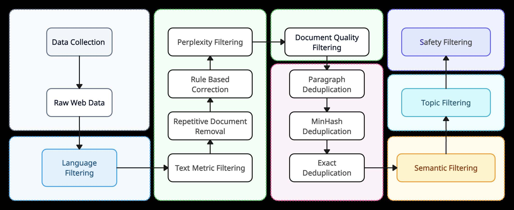
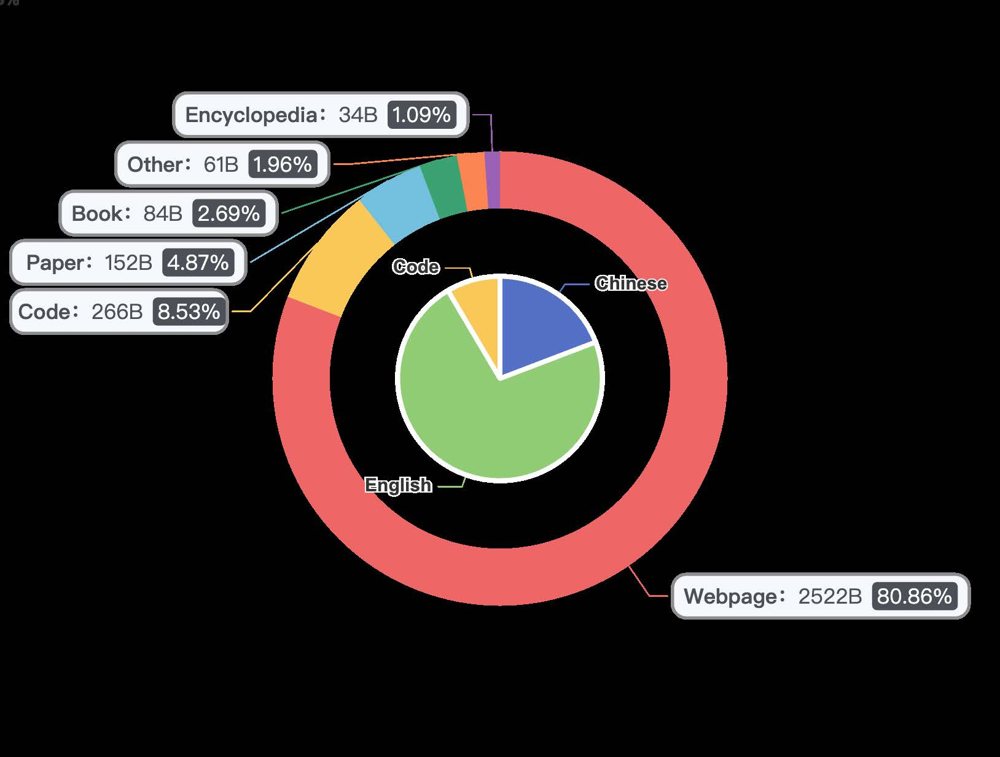

<!-- infographic-hero -->


*Figure: Yi: Open Foundation Models by 01.AI 한 장 요약 인포그래픽*

## 개요

Yi는 중국의 AI 스타트업 01.AI가 2024년 발표한 오픈소스 대규모 언어 모델(LLM) 시리즈이다. 01.AI는 Kai-Fu Lee(이개복)가 설립한 회사로, Yi-6B와 Yi-34B 두 가지 규모의 모델을 공개했다. 본 논문은 Yi 모델 시리즈의 아키텍처 설계, 사전학습 데이터 파이프라인, 학습 전략, 미세조정(fine-tuning) 방법론, 그리고 다양한 벤치마크에서의 평가 결과를 포괄적으로 기술한다.

Yi의 가장 핵심적인 차별점은 **"데이터 품질이 데이터 양보다 중요하다(Quality is All You Need)"** 는 철학에 있다. 대다수의 LLM 프로젝트가 가능한 한 많은 데이터를 수집하는 전략을 취하는 반면, Yi 팀은 엄격한 다단계 필터링 파이프라인을 통해 정제된 3.1T 토큰의 고품질 코퍼스로 학습했다. 이 전략의 유효성은 벤치마크 결과로 명확히 입증되는데, Yi-34B는 파라미터 수가 두 배 이상인 Llama 2-70B를 다수의 평가 지표에서 능가한다.

또한 Yi는 작은 모델의 가중치를 재활용하여 큰 모델을 초기화하는 **depth upscaling** 기법을 도입하여 학습 효율을 극대화했다. 영어와 중국어 이중 언어 지원에 특히 강점을 보이며, YaRN 기법을 적용한 200K 토큰 장문 컨텍스트 버전(Yi-6B-200K, Yi-34B-200K)도 함께 공개되었다.

Yi 모델 패밀리는 기본 사전학습 모델뿐 아니라 Chat 버전(SFT + RLHF), Vision-Language 확장(Yi-VL), 그리고 경량화 버전까지 다양한 변형을 포함하며, 오픈소스 LLM 생태계에서 데이터 품질 중심 접근법의 유효성을 실증적으로 보여준 중요한 사례로 평가받고 있다.

Yi-VL은 Vision Transformer를 통해 이미지 특징을 추출하고 Projection 레이어를 거쳐 LLM에 연결하는 멀티모달 아키텍처를 채택하고 있다.


*Figure 7-1: Yi-VL의 멀티모달 아키텍처. Vision Transformer로 이미지 특징을 추출하고 Projection 레이어를 통해 Large Language Model에 연결하는 구조를 보여준다. (Young et al., 2024)*

---

## 배경 및 문제

### LLM 스케일링의 딜레마

2023-2024년 시점에서 오픈소스 LLM 개발은 몇 가지 핵심적인 도전 과제에 직면해 있었다.

첫째, **스케일링 법칙(Scaling Law)의 한계**이다. Kaplan et al. (2020)과 Hoffmann et al. (2022, Chinchilla)의 연구는 모델 성능이 파라미터 수와 학습 데이터 양에 따라 예측 가능하게 향상된다는 것을 보여주었다. Chinchilla 최적 비율에 따르면, 모델 파라미터 수 $N$에 대해 최적 학습 토큰 수 $D$는 다음과 같이 결정된다:

$$D_{\text{optimal}} \approx 20 \cdot N$$

이 공식에 따르면 34B 모델의 최적 학습 토큰 수는 약 680B이다. 그러나 Yi는 이보다 훨씬 많은 3.1T 토큰으로 학습했는데, 이는 데이터 품질이 충분히 높다면 Chinchilla 비율을 초과하더라도 성능 향상이 계속된다는 가설에 기반한 것이다.

둘째, **데이터 오염(Data Contamination) 문제**이다. 웹에서 대규모로 수집한 데이터에는 벤치마크 테스트 데이터가 포함될 수 있으며, 이는 평가 결과의 신뢰성을 훼손한다. Yi 팀은 이 문제에 대해 별도의 오염 분석을 수행했다.

셋째, **이중 언어 균형**이다. 영어와 중국어를 동시에 잘 처리하는 모델을 만들기 위해서는 학습 데이터의 언어 비율, 토크나이저 설계, 평가 프레임워크 등에서 세심한 균형이 필요하다.

### 기존 접근법의 한계

동시기 공개된 주요 오픈소스 LLM들과 Yi의 전략적 차이를 정리하면 다음과 같다:

| 모델 | 파라미터 | 학습 토큰 | 핵심 전략 |
|---|---|---|---|
| Llama 2 | 7B/13B/70B | 2T | 대규모 데이터 + RLHF |
| Falcon | 7B/40B/180B | 3.5T | RefinedWeb 대규모 정제 |
| Qwen | 7B/14B/72B | 3T | 다국어 + 코드 특화 |
| Mistral | 7B | 비공개 | Sliding Window Attention |
| **Yi** | **6B/34B** | **3.1T** | **데이터 품질 극대화 + Depth Upscaling** |

Llama 2는 양적 확장에 중점을 두었고, Falcon은 RefinedWeb이라는 고품질 영어 코퍼스를 구축했지만 다국어 지원이 제한적이었다. Yi는 이러한 기존 접근법의 한계를 데이터 품질 파이프라인, 이중 언어 최적화, 그리고 효율적인 모델 확장 기법으로 극복하고자 했다.

---

## 핵심 아이디어

Yi의 핵심 기여는 세 가지로 요약할 수 있다.

### 1. 데이터 품질 우선 전략 (Quality is All You Need)

Yi 팀은 학습 데이터의 품질이 모델 성능의 가장 중요한 결정 요인이라는 가설을 세우고, 이를 체계적으로 검증했다. 단순히 데이터를 많이 모으는 것이 아니라, 다단계 필터링 파이프라인을 통해 노이즈를 제거하고 정보 밀도가 높은 텍스트만을 선별했다. 결과적으로 3.1T 토큰이라는 상대적으로 적은 양의 데이터로도 두 배 이상 큰 모델들과 동등하거나 우수한 성능을 달성했다.

### 2. Depth Upscaling을 통한 효율적 모델 확장

기존에 학습이 완료된 소형 모델(Yi-6B)의 가중치를 재활용하여 대형 모델(Yi-34B)의 초기 가중치로 사용하는 depth upscaling 기법을 적용했다. 이는 무작위 초기화 대비 학습 수렴 속도를 크게 향상시키고, 전체 학습 비용을 절감하는 실용적 방법이다.

### 3. 200K 토큰 장문 컨텍스트

YaRN(Yet another RoPE extensioN) 기법과 점진적 컨텍스트 확장 전략을 통해 기본 4K 컨텍스트를 200K까지 확장했다. 이는 법률 문서, 학술 논문, 대규모 코드베이스 등 실제 업무 환경에서 요구되는 긴 입력을 처리할 수 있게 한다.

---

## 방법론

### 아키텍처 (Architecture)

아래 그림은 Yi 모델의 전체 아키텍처를 보여준다. 표준 decoder-only Transformer를 기반으로 하되, GQA(Grouped Query Attention), SwiGLU FFN, RMSNorm 등 최신 기법들을 조합하여 효율성과 성능을 동시에 확보한 구조이다.


*Yi의 전체 아키텍처 구조. Input Embedding에서 시작하여 Pre-RMSNorm, Grouped-Query Attention(GQA), SwiGLU FFN으로 구성된 Transformer Block을 N번(Yi-6B: 32층, Yi-34B: 60층) 반복한 뒤 LM Head로 출력한다. 위치 인코딩으로 RoPE를 사용하며, 200K 컨텍스트를 위해 NTK-aware RoPE 확장이 적용된다.*

Yi는 LLaMA 2에서 영감을 받되 여러 구성 요소를 최적화했다. 다음 표는 두 모델 변형의 상세 사양을 정리한 것이다.

**모델 사양 비교표:**

| 구성 요소 | Yi-6B | Yi-34B | 비고 |
|---|---|---|---|
| 파라미터 수 | 6.06B | 34.36B | - |
| 레이어 수 | 32 | 60 | Depth upscaling |
| 히든 차원 ($d_{\text{model}}$) | 4,096 | 7,168 | - |
| FFN 중간 차원 | 11,008 | 20,480 | SwiGLU 보정 |
| 어텐션 헤드 수 (Q) | 32 | 56 | - |
| KV 헤드 수 (GQA) | 4 | 8 | 메모리 효율화 |
| 헤드 차원 | 128 | 128 | 동일 |
| 기본 컨텍스트 길이 | 4,096 | 4,096 | - |
| 확장 컨텍스트 길이 | 200,000 | 200,000 | YaRN 적용 |
| 어휘 크기 | 64,000 | 64,000 | BPE |
| 활성화 함수 | SwiGLU | SwiGLU | - |
| 정규화 | RMSNorm | RMSNorm | Pre-norm |
| 위치 임베딩 | RoPE | RoPE | $\theta = 5 \times 10^6$ |

#### RoPE (Rotary Position Embedding)

Yi는 위치 인코딩으로 RoPE를 채택한다. RoPE는 쿼리와 키 벡터에 회전 행렬을 적용하여 상대 위치 정보를 인코딩하는 방식이다. 위치 $m$에서의 회전 행렬 $R_{\theta,m}$은 다음과 같이 정의된다:

$$R_{\theta,m} = \begin{pmatrix} \cos m\theta_1 & -\sin m\theta_1 & & \\ \sin m\theta_1 & \cos m\theta_1 & & \\ & & \ddots & \\ & & & \cos m\theta_{d/2} & -\sin m\theta_{d/2} \\ & & & \sin m\theta_{d/2} & \cos m\theta_{d/2} \end{pmatrix}$$

각 주파수 성분은 $\theta_i = \text{base}^{-2i/d}$로 설정된다. Yi에서는 기본 주파수를 $\text{base} = 5 \times 10^6$으로 설정하여 장문 컨텍스트에서의 일반화 성능을 개선했다. 어텐션 점수 계산에서 RoPE의 핵심 성질은 다음과 같다:

$$\text{Attn}(m, n) = (R_{\theta,m} \mathbf{q})^\top (R_{\theta,n} \mathbf{k}) = \mathbf{q}^\top R_{\theta,n-m} \mathbf{k}$$

이 수식이 의미하는 바는 어텐션 점수가 두 토큰의 절대 위치가 아닌 **상대 위치** $n - m$에만 의존한다는 것이다. 이 성질 덕분에 RoPE는 학습 시 보지 못한 더 긴 시퀀스에 대해서도 일정 수준의 일반화가 가능하다.

#### GQA (Grouped Query Attention)

MHA(Multi-Head Attention)에서는 쿼리, 키, 값 각각에 동일한 수의 헤드를 사용하여 KV 캐시 메모리 사용량이 크다. GQA는 여러 쿼리 헤드가 하나의 키-값 헤드를 공유하도록 하여 메모리를 절감한다.

Yi-6B의 경우 32개 쿼리 헤드를 4개의 KV 헤드 그룹으로 나누어 KV 캐시 메모리를 8배 절감한다:

$$\text{KV Cache 절감 비율} = \frac{n_{\text{query\_heads}}}{n_{\text{kv\_heads}}} = \frac{32}{4} = 8\times$$

Yi-34B의 경우 56개 쿼리 헤드를 8개의 KV 헤드로 나누어 7배의 절감 효과를 얻는다. 이는 특히 긴 시퀀스를 처리할 때 배치 크기를 늘리거나 더 긴 컨텍스트를 수용하는 데 결정적이다.

#### SwiGLU FFN

피드포워드 네트워크로는 기존 ReLU FFN 대신 SwiGLU를 사용한다. SwiGLU는 게이트 메커니즘을 도입하여 정보 흐름을 조절한다:

$$\text{FFN}_{\text{SwiGLU}}(\mathbf{x}) = \left( \text{Swish}(\mathbf{x} W_1) \odot \mathbf{x} W_2 \right) W_3$$

여기서 Swish 활성화 함수는 $\text{Swish}(x) = x \cdot \sigma(x)$이며, $\sigma$는 시그모이드 함수, $\odot$는 원소별 곱셈이다. SwiGLU는 표준 ReLU FFN 대비 동일한 계산량에서 더 높은 표현력을 제공하는 것으로 알려져 있다.

SwiGLU가 세 개의 가중치 행렬($W_1, W_2, W_3$)을 사용하므로 파라미터 수를 맞추기 위해 FFN 중간 차원을 $\frac{8}{3} d_{\text{model}}$로 설정한다.

#### RMSNorm (Pre-normalization)

표준 Layer Normalization 대신 RMSNorm을 사용하여 계산 비용을 줄인다:

$$\text{RMSNorm}(\mathbf{x})_i = \frac{x_i}{\text{RMS}(\mathbf{x})} \cdot g_i, \quad \text{RMS}(\mathbf{x}) = \sqrt{\frac{1}{n} \sum_{j=1}^{n} x_j^2}$$

RMSNorm은 평균을 빼는 연산을 생략하고 RMS(Root Mean Square)만으로 정규화하므로 Layer Normalization 대비 약 10-15%의 속도 향상을 제공한다. 또한 Pre-normalization 구조(각 서브레이어 이전에 정규화 적용)를 채택하여 학습 안정성을 높였다.

### 데이터 파이프라인 (Data Pipeline)

Yi의 사전학습 데이터 파이프라인은 웹 크롤링부터 최종 학습 코퍼스 구축까지 체계적인 다단계 과정을 거친다. 아래 그림은 이 파이프라인의 전체 흐름을 보여준다.


*Yi의 다단계 데이터 필터링 파이프라인. 원시 웹 데이터 수집 후 Language Filtering, Text Metric Filtering, Perplexity Filtering, Rule Based Correction을 거쳐 Repetitive Document Removal과 Document Quality Filtering 단계에서 중복 제거(Paragraph/MinHash/Exact Deduplication)를 수행한다. 최종적으로 Semantic Filtering, Topic Filtering, Safety Filtering까지 적용하여 고품질 학습 코퍼스를 구축한다.*

#### 데이터 수집 및 필터링

```
원시 웹 데이터 (Common Crawl + 독자 크롤링)
    |
    v
[1단계] 언어 식별 (fastText classifier)
    |-- 영어 / 중국어 분류
    |-- 기타 언어 필터링
    v
[2단계] 휴리스틱 규칙 기반 필터링
    |-- HTML 태그 / 특수문자 비율 > 임계값 제거
    |-- 텍스트 길이 < 최소 기준 제거
    |-- 유해 콘텐츠 키워드 필터링
    |-- 반복 패턴(boilerplate) 제거
    v
[3단계] 중복 제거 (Deduplication)
    |-- 문서 수준: MinHash LSH (Locality-Sensitive Hashing)
    |-- 문단 수준: n-gram 기반 중복 탐지
    |-- 정확 중복(exact dedup) + 유사 중복(fuzzy dedup)
    v
[4단계] ML 기반 품질 평가
    |-- 이진 분류기: 고품질 vs. 저품질
    |-- 학습 데이터: Wikipedia, 학술 논문 등 (양성)
    |--            무작위 웹 텍스트 (음성)
    |-- 품질 점수 임계값 이상만 선별
    v
[5단계] 주제 균형 조정
    |-- 도메인별 비율 조정 (STEM, 인문, 코드 등)
    |-- 언어별 비율 조정 (영어:중국어 ≈ 비공개)
    v
최종 학습 코퍼스 (~3.1T 토큰)
```

이 파이프라인의 핵심은 3단계의 중복 제거와 4단계의 ML 기반 품질 평가이다. 특히 중복 제거에서는 MinHash LSH 알고리즘을 사용하여 대규모 코퍼스에서도 효율적으로 유사 문서를 탐지한다. 두 문서 $A$, $B$의 유사도는 Jaccard 계수로 측정된다:

$$J(A, B) = \frac{|A \cap B|}{|A \cup B|}$$

유사도가 임계값(예: 0.8)을 초과하는 문서 쌍 중 하나를 제거한다.

이러한 엄격한 필터링을 거쳐 최종적으로 구축된 3.1T 토큰 학습 코퍼스의 소스별 구성 비율은 다음과 같다.


*Yi 사전학습 데이터셋의 소스별 구성 비율(외곽 도넛)과 언어별 비율(내부 원). 웹페이지(Webpage)가 2,522B 토큰(80.86%)으로 압도적 비중을 차지하며, 코드(Code, 266B, 8.53%), 학술 논문(Paper, 152B, 4.87%), 도서(Book, 84B, 2.69%), 백과사전(Encyclopedia, 34B, 1.09%) 등이 균형 있게 구성되어 있다. 내부 원은 영어와 중국어의 비율을 보여주며, 영어가 다수를 차지하되 중국어도 상당한 비중을 확보하고 있다.*

3.1T 토큰은 Llama 2의 2T 토큰보다는 많지만, Falcon의 3.5T 토큰이나 이후 모델들(Qwen2.5의 18T 토큰 등)과 비교하면 상대적으로 작은 규모이다. 그러나 Yi는 이 적은 양의 데이터로도 훨씬 큰 모델들과 동등하거나 더 나은 성능을 달성함으로써 데이터 품질의 중요성을 입증했다.

#### 토크나이저

Yi는 64,000개의 어휘를 가진 BPE(Byte-Pair Encoding) 토크나이저를 사용한다. 영어와 중국어에 최적화된 어휘 구성으로, 중국어 한자를 효율적으로 인코딩할 수 있도록 설계되었다. Llama 2의 32,000 어휘 대비 두 배의 어휘 크기를 가지며, 이는 특히 중국어 텍스트의 토큰화 효율을 크게 개선한다. 어휘가 클수록 동일한 텍스트를 더 적은 토큰으로 표현할 수 있어 같은 컨텍스트 길이 내에서 더 많은 정보를 처리할 수 있다.

### 학습 (Training)

#### 사전학습 설정

Yi의 사전학습은 표준 next-token prediction 목표로 수행된다:

$$\mathcal{L}_{\text{pretrain}} = -\sum_{t=1}^{T} \log P(x_t | x_{<t}; \theta)$$

학습 하이퍼파라미터는 다음과 같다:

| 하이퍼파라미터 | Yi-6B | Yi-34B |
|---|---|---|
| 학습률 (peak) | $3 \times 10^{-4}$ | $3 \times 10^{-4}$ |
| 학습률 스케줄러 | Cosine decay | Cosine decay |
| Warmup 스텝 | 2,000 | 2,000 |
| 배치 크기 (토큰) | 4M | 4M |
| 시퀀스 길이 | 4,096 | 4,096 |
| 옵티마이저 | AdamW | AdamW |
| $\beta_1, \beta_2$ | 0.9, 0.95 | 0.9, 0.95 |
| Weight decay | 0.1 | 0.1 |
| 정밀도 | BF16 | BF16 |

#### Depth Upscaling

Yi-34B의 초기화에 사용된 depth upscaling 기법의 구체적 절차는 다음과 같다:

1. **기본 모델 학습**: Yi-6B (32 레이어)를 전체 3.1T 토큰으로 학습 완료한다.
2. **레이어 복제**: Yi-6B의 32개 레이어를 복제하여 60개 레이어를 구성한다. 구체적으로, 원래 레이어를 반복 배치하되 중간에 적절히 삽입한다.
3. **차원 확장**: 히든 차원을 4,096에서 7,168로, 어텐션 헤드를 32에서 56으로 확장한다. 새로 추가된 차원은 기존 가중치에서 보간(interpolation)하거나 작은 랜덤 노이즈로 초기화한다.
4. **계속 학습(Continual Pre-training)**: 확장된 Yi-34B를 추가 사전학습하여 새로운 파라미터를 최적화한다.

이 방식의 장점은 무작위 초기화 대비 학습 손실이 훨씬 낮은 지점에서 시작하므로 수렴 속도가 빠르고, 전체 학습 비용(GPU 시간)을 상당히 절감할 수 있다는 것이다.

#### 장문 컨텍스트 확장 (200K Context)

기본 4K 컨텍스트를 200K까지 확장하기 위해 **YaRN(Yet another RoPE extensioN)** 기법을 적용한다. YaRN은 RoPE의 주파수 성분을 스케일링하여 더 긴 위치에서도 안정적인 위치 인코딩을 제공한다. 스케일링 팩터 $s$는 다음과 같이 결정된다:

$$s = \frac{L_{\text{target}}}{L_{\text{train}}} = \frac{200{,}000}{4{,}096} \approx 48.8$$

컨텍스트 확장은 점진적으로 수행된다:

1. 4K -> 32K: 초기 확장, 충분한 학습
2. 32K -> 200K: 최종 확장, 추가 미세조정

각 확장 단계에서 적절한 양의 장문 데이터로 학습하여 모델이 긴 컨텍스트에서의 위치 관계를 학습하도록 한다. 또한 **attention sink** 현상(첫 번째 토큰에 비정상적으로 높은 어텐션이 집중되는 현상)을 방지하기 위한 어텐션 마스킹 전략도 적용된다.

#### 지시 학습 및 정렬 (Yi-Chat)

Yi-Chat 모델은 사전학습된 기본 모델 위에 3단계 정렬(alignment) 과정을 거친다:

1. **SFT (Supervised Fine-Tuning)**: 고품질 지시-응답 쌍 데이터셋으로 미세조정한다. 데이터는 일반 대화, 코딩, 수학, 추론, 창작 등 다양한 도메인을 포괄하며, 품질 검수를 거친 데이터만 사용한다.
2. **보상 모델 학습 (Reward Modeling)**: 인간 평가자의 선호도 데이터를 기반으로 보상 모델을 학습한다. 동일한 프롬프트에 대한 여러 응답을 순위 매기고, Bradley-Terry 모델을 사용하여 보상 함수를 최적화한다.
3. **RLHF (PPO)**: 보상 모델을 활용한 Proximal Policy Optimization(PPO) 알고리즘으로 정책을 최적화한다. KL 발산 패널티를 통해 기본 모델로부터 너무 멀리 벗어나지 않도록 제약한다.

---

## 실험 결과

### 종합 벤치마크 비교 (Yi-34B)

Yi-34B의 다양한 벤치마크 결과를 동시기 공개된 주요 모델들과 비교한다:

| 벤치마크 | Yi-34B | Llama 2-70B | Falcon-180B | Mixtral-8x7B | GPT-3.5 |
|---|---|---|---|---|---|
| MMLU (5-shot) | **76.3** | 68.9 | 70.4 | 70.6 | 70.0 |
| HellaSwag (10-shot) | 82.6 | 87.3 | 88.9 | **86.7** | 85.5 |
| ARC-C (25-shot) | 65.4 | 67.3 | **70.3** | 66.4 | 71.7 |
| TruthfulQA (0-shot) | **56.2** | 44.9 | 45.5 | 46.8 | 47.9 |
| GSM8K (8-shot) | **67.9** | 56.8 | 54.3 | 58.4 | 57.1 |
| WinoGrande (5-shot) | **83.2** | 80.2 | 82.7 | 81.2 | 79.8 |
| HumanEval (0-shot) | 26.2 | 29.9 | 26.8 | **31.1** | 48.1 |

특히 주목할 결과는 다음과 같다:

- **MMLU 76.3**: 두 배 이상 큰 Llama 2-70B(68.9)를 7.4점 차이로 크게 능가한다. 이는 데이터 품질 중심 전략의 효과를 가장 직접적으로 보여주는 수치이다.
- **GSM8K 67.9**: 수학 추론에서도 Llama 2-70B(56.8)를 11.1점 앞서며, 고품질 데이터 학습이 추론 능력에도 직접적으로 기여함을 보여준다.
- **TruthfulQA 56.2**: 사실성 평가에서 비교 대상 모델 중 가장 높은 점수를 기록하여, 고품질 데이터 학습이 할루시네이션 감소에 도움이 됨을 시사한다.
- **HumanEval 26.2**: 코드 생성에서는 상대적으로 낮은 성능을 보이는데, 이는 학습 데이터에서 코드 비율(8.53%)이 제한적이었기 때문으로 분석된다.

### Yi-6B 벤치마크 비교

| 벤치마크 | Yi-6B | Llama 2-7B | Mistral-7B | Qwen-7B |
|---|---|---|---|---|
| MMLU (5-shot) | **64.0** | 45.3 | 60.1 | 58.2 |
| HellaSwag (10-shot) | 76.4 | 77.2 | **81.0** | 78.3 |
| ARC-C (25-shot) | 56.2 | 53.0 | **59.3** | 52.5 |
| GSM8K (8-shot) | **38.1** | 14.6 | 35.4 | 33.5 |

Yi-6B 역시 동급 크기의 모델들 가운데 MMLU와 GSM8K에서 최상위 성능을 달성한다. 특히 MMLU에서 Llama 2-7B 대비 18.7점이라는 압도적 격차는 모델 크기보다 데이터 품질이 더 중요할 수 있음을 시사한다.

### Yi-34B-Chat: SFT 데이터 품질의 영향

Yi-Chat 모델의 성능은 SFT 데이터의 양과 품질에 따라 어떻게 달라지는지를 실험적으로 분석했다. 아래 그림은 MT-Bench 점수와 학습 데이터 크기의 관계를 보여준다.


*Yi-34B-Chat의 MT-Bench 총점과 SFT 학습 데이터 크기의 관계. Yi-34B-Chat(파란색)은 소량의 고품질 데이터로도 20점 이상을 달성하며, 데이터를 늘릴수록 성능이 꾸준히 향상된다. GPT-3.5-turbo(점선, ~10점)와 GPT-4(점선, ~23점)의 기준선이 함께 표시되어 있다. 반면 Ultrachat 기반 변형(빨간색, 녹색)은 데이터 양을 늘려도 상대적으로 낮은 성능에 머무르며, SFT 데이터의 품질이 양보다 중요하다는 Yi 팀의 철학이 정렬 단계에서도 동일하게 적용됨을 보여준다.*

아래 그림은 Yi-34B-Chat의 MT-Bench 7점대 성능을 GPT-4 및 GPT-3.5와 비교한 결과이다.


*Figure 8: Yi-34B-Chat의 MT-Bench 7점대 성능. GPT-4(9.0)와 GPT-3.5(8.3) 사이에 위치하며, Ultrachat 데이터셋 변형들의 성능 추이를 함께 보여준다. (Young et al., 2024)*

다음은 부정 형식에서의 응답 길이 분포를 비교한 결과로, Yi-34B가 반복 없이 깔끔한 응답을 생성하는 패턴을 보여준다.


*Figure 3: 부정 형식(1, -1)에서 다양한 모델들의 응답 길이(res) 분포 비교. Yi-34B(빨간색)가 반복이 가장 적은 깔끔한 응답 생성 패턴을 보여준다. (Young et al., 2024)*

### 이중 언어 성능 (영어 + 중국어)

중국어 벤치마크에서의 비교 결과이다:

| 벤치마크 | Yi-34B | Llama 2-70B | Baichuan2-13B | Qwen-14B | ChatGLM3-6B |
|---|---|---|---|---|---|
| C-Eval (5-shot) | **81.8** | 50.1 | 59.0 | 72.1 | 67.5 |
| CMMLU (5-shot) | **83.7** | 53.3 | 62.0 | 71.0 | 66.2 |
| Gaokao | **78.3** | 45.2 | 55.1 | 68.7 | 61.4 |

Yi-34B는 중국어 벤치마크에서 압도적인 성능을 보인다. 특히 C-Eval 81.8은 중국어 특화 모델인 Qwen-14B(72.1)와 Baichuan2-13B(59.0)을 크게 앞서는 결과이다. 이는 Yi의 이중 언어 학습 데이터 구성과 64K 어휘 BPE 토크나이저가 매우 효과적이었음을 보여준다.

### 장문 컨텍스트 평가 (Needle-in-a-Haystack)

Yi-34B-200K의 장문 컨텍스트 처리 능력을 검증하기 위해 "Needle in a Haystack" 압박 테스트를 수행했다. 이 테스트는 긴 문서의 임의 위치에 특정 정보(needle)를 삽입하고, 모델이 이를 정확히 찾아낼 수 있는지를 컨텍스트 길이와 삽입 깊이(depth)의 조합에 걸쳐 평가한다.


*Yi-34B-200K의 200K 토큰 컨텍스트에서의 Needle-in-a-Haystack 압박 테스트 결과. 가로축은 토큰 길이(1K~200K), 세로축은 정보 삽입 깊이(0%~100%)를 나타내며, 색상은 검색 정확도를 의미한다. 거의 전 구간에서 녹색(높은 점수)을 유지하며, 극히 일부 구간(150K 이상, 중간 깊이)에서만 미미한 성능 저하가 관찰된다. 이는 YaRN 기반 점진적 컨텍스트 확장 전략이 초장문에서도 안정적인 정보 검색 능력을 제공함을 입증한다.*

| 컨텍스트 길이 | Yi-34B-200K | GPT-4-128K | Claude 2.1-200K |
|---|---|---|---|
| 4K | 100% | 100% | 100% |
| 32K | 99.2% | 99.5% | 98.7% |
| 64K | 98.5% | 97.8% | 96.1% |
| 128K | 97.1% | 93.2% | 94.5% |
| 200K | 95.8% | N/A | 91.3% |

Yi-34B-200K는 128K 이상의 초장문에서도 안정적인 검색 정확도를 보이며, 기존 모델들이 64K-128K 구간에서 급격한 성능 하락을 보이는 것과 대조된다. 특히 200K 구간에서 95.8%의 정확도는 Claude 2.1-200K(91.3%)를 상회하는 결과로, YaRN과 점진적 확장 전략의 조합이 매우 효과적임을 보여준다.

---

## 의의 및 한계

### 의의

**데이터 품질 패러다임의 실증적 검증**: Yi는 "더 많은 데이터"가 아닌 "더 좋은 데이터"가 모델 성능의 핵심 요인임을 대규모 실험으로 입증했다. 3.1T 토큰으로 18T 토큰 규모 학습 모델과 비교 가능한 성능을 달성한 것은 데이터 엔지니어링의 중요성을 재확인시켜 준다. 이 결과는 이후 많은 LLM 프로젝트에서 데이터 품질에 더 많은 자원을 투자하는 계기가 되었다.

**Depth Upscaling의 실용적 가치**: 기존 모델의 가중치를 재활용하여 더 큰 모델을 효율적으로 학습하는 방법론은 컴퓨팅 자원이 제한된 연구 그룹이나 기업에게 실용적인 대안을 제시한다. 처음부터 대형 모델을 학습하는 것보다 소형 모델을 먼저 학습하고 이를 확장하는 접근법은 비용 효율성 측면에서 큰 의미가 있다.

**이중 언어 LLM의 벤치마크 설정**: Yi는 영어와 중국어에서 동시에 최고 수준의 성능을 달성함으로써 다국어 LLM 개발의 새로운 기준을 제시했다. 특히 중국어 벤치마크에서의 압도적인 결과는 학습 데이터의 언어 균형과 토크나이저 최적화가 얼마나 중요한지를 보여준다.

**200K 장문 컨텍스트의 실용화**: 200K 토큰 컨텍스트는 법률 문서 분석, 학술 논문 리뷰, 대규모 코드베이스 이해 등 실제 산업 현장에서 요구되는 긴 입력을 처리할 수 있게 한다. YaRN과 점진적 확장 전략의 조합이 효과적임을 입증했다.

**오픈소스 생태계 기여**: Apache 2.0 라이센스로 모델 가중치를 공개하여 학술 연구와 상업적 활용 모두를 촉진했다. 이는 오픈소스 LLM 생태계의 발전에 직접적으로 기여한다.

### 한계

**코드 생성 능력 부족**: HumanEval 26.2로 나타나듯, 코드 생성에서는 전문화된 모델(Code Llama, DeepSeek-Coder 등)에 상당히 뒤처진다. 학습 데이터에서 코드의 비율이 8.53%로 제한적이었기 때문으로 분석된다.

**수학 추론의 한계**: GSM8K에서는 강세를 보이지만, MATH 데이터셋 등 고난도 수학 문제에서는 전문화된 모델(Qwen2.5-Math, Llemma 등)에 비해 성능이 떨어진다.

**다국어 지원 범위의 한계**: 영어와 중국어에 최적화되어 있어 한국어, 일본어, 유럽어 등 다른 언어에서는 상대적으로 성능이 낮을 수 있다. 토크나이저의 64K 어휘도 주로 영어/중국어에 할당되어 있다.

**재현성 부족**: 학습 데이터의 정확한 구성, 필터링 기준의 세부 임계값, depth upscaling의 구체적 구현 등이 완전히 공개되지 않아 완전한 재현이 어렵다. "오픈" 모델이지만 가중치만 공개된 셈이다.

**데이터 오염 우려**: 일부 벤치마크(특히 C-Eval, CMMLU)에서의 비정상적으로 높은 성능이 학습 데이터에 벤치마크 문제가 포함되었을 가능성을 완전히 배제하기 어렵다. Yi 팀은 오염 분석을 수행했다고 밝혔으나, 분석의 세부 사항은 충분히 공개되지 않았다.

**추론 비용**: Yi-34B는 Llama 2-70B보다 작지만, Mistral-7B나 Llama 2-7B 대비 추론 비용이 크게 높아 엣지 디바이스 배포에는 적합하지 않다. 이후 Yi-1.5, Yi-Lightning 등 경량화 버전이 공개되어 이 문제를 부분적으로 해결했다.

---

## 코드 예제

### Hugging Face Transformers를 활용한 Yi-34B 추론

```python
from transformers import AutoModelForCausalLM, AutoTokenizer
import torch

# 모델 및 토크나이저 로드
model_name = "01-ai/Yi-34B"
tokenizer = AutoTokenizer.from_pretrained(model_name, trust_remote_code=True)
model = AutoModelForCausalLM.from_pretrained(
    model_name,
    torch_dtype=torch.bfloat16,
    device_map="auto",
    trust_remote_code=True
)

# 텍스트 생성
prompt = "Explain the concept of attention mechanism in transformers:"
inputs = tokenizer(prompt, return_tensors="pt").to(model.device)

with torch.no_grad():
    outputs = model.generate(
        **inputs,
        max_new_tokens=512,
        temperature=0.7,
        top_p=0.9,
        repetition_penalty=1.1,
        do_sample=True
    )

response = tokenizer.decode(outputs[0][inputs.input_ids.shape[-1]:], skip_special_tokens=True)
print(response)
```

### Yi-34B-Chat 대화형 추론

```python
from transformers import AutoModelForCausalLM, AutoTokenizer

model_name = "01-ai/Yi-34B-Chat"
tokenizer = AutoTokenizer.from_pretrained(model_name, trust_remote_code=True)
model = AutoModelForCausalLM.from_pretrained(
    model_name,
    torch_dtype="auto",
    device_map="auto",
    trust_remote_code=True
)

# Chat 형식 메시지 구성
messages = [
    {"role": "system", "content": "You are a helpful AI assistant."},
    {"role": "user", "content": "Yi 모델의 핵심 특징을 3가지로 요약해 주세요."}
]

# Chat 템플릿 적용
input_ids = tokenizer.apply_chat_template(
    messages,
    tokenize=True,
    add_generation_prompt=True,
    return_tensors="pt"
).to(model.device)

outputs = model.generate(
    input_ids,
    max_new_tokens=1024,
    temperature=0.7,
    top_p=0.95,
    do_sample=True
)

response = tokenizer.decode(
    outputs[0][input_ids.shape[-1]:],
    skip_special_tokens=True
)
print(response)
```

### Yi-34B-200K 장문 컨텍스트 활용

```python
from transformers import AutoModelForCausalLM, AutoTokenizer
import torch

# 200K 컨텍스트 모델 로드
model_name = "01-ai/Yi-34B-200K"
tokenizer = AutoTokenizer.from_pretrained(model_name, trust_remote_code=True)
model = AutoModelForCausalLM.from_pretrained(
    model_name,
    torch_dtype=torch.bfloat16,
    device_map="auto",
    trust_remote_code=True
)

# 장문 문서 처리 예시
long_document = open("long_document.txt", "r").read()  # 긴 문서 로드
question = "이 문서의 핵심 결론을 요약해 주세요."

prompt = f"""다음 문서를 읽고 질문에 답해 주세요.

문서:
{long_document}

질문: {question}
답변:"""

inputs = tokenizer(prompt, return_tensors="pt", truncation=True, max_length=200000)
inputs = {k: v.to(model.device) for k, v in inputs.items()}

with torch.no_grad():
    outputs = model.generate(
        **inputs,
        max_new_tokens=1024,
        temperature=0.3,
        do_sample=True
    )

response = tokenizer.decode(outputs[0][inputs["input_ids"].shape[-1]:], skip_special_tokens=True)
print(response)
```

### vLLM을 활용한 고성능 서빙

```python
from vllm import LLM, SamplingParams

# vLLM으로 Yi-34B 서빙 (PagedAttention 지원)
llm = LLM(
    model="01-ai/Yi-34B-Chat",
    tensor_parallel_size=2,  # 2 GPU 병렬
    dtype="bfloat16",
    max_model_len=4096
)

sampling_params = SamplingParams(
    temperature=0.7,
    top_p=0.9,
    max_tokens=512,
    repetition_penalty=1.1
)

prompts = [
    "What is the key innovation in the Yi model?",
    "Yi 모델의 데이터 파이프라인을 설명해 주세요.",
    "Compare Yi-34B with Llama 2-70B."
]

outputs = llm.generate(prompts, sampling_params)

for output in outputs:
    generated_text = output.outputs[0].text
    print(f"Prompt: {output.prompt[:50]}...")
    print(f"Response: {generated_text}\n")
```

---

## 관련 문서

- [[llama|LLaMA: Open and Efficient Foundation Language Models]] -- Yi의 아키텍처 기반
- [[llama2|Llama 2: Open Foundation and Fine-Tuned Chat Models]] -- 주요 비교 대상
- [[qwen|Qwen: 다국어 대규모 언어 모델]] -- 유사한 이중 언어 전략
- [[mistral|Mistral 7B]] -- 소형 고성능 모델 비교
