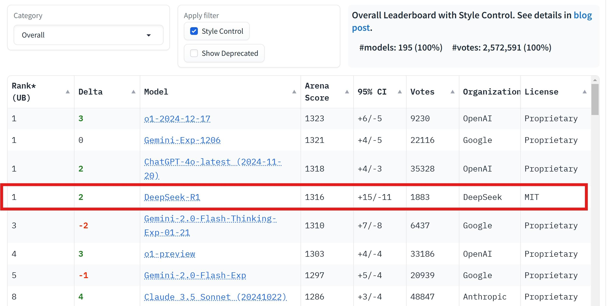

# DeepSeek-R1: 강화학습으로 LLM의 추론 능력을 이끌어내다

## 논문 개요

:::info
**Paper:** DeepSeek-R1: Incentivizing Reasoning Capability in LLMs via Reinforcement Learning (arXiv:2501.12948, 2025.01)
**저자:** DeepSeek-AI
**소속:** DeepSeek (中国, 杭州)
**모델:** [HuggingFace: deepseek-ai/DeepSeek-R1](https://huggingface.co/deepseek-ai/DeepSeek-R1)
**라이선스:** MIT
:::

2025년 1월 20일, DeepSeek의 R1 공개는 AI 연구사에서 가장 충격적인 사건 중 하나였다. 이 논문의 핵심 질문은 단순하면서도 근본적이다: **"LLM이 추론 능력을 '배울' 수 있는가, 아니면 '스스로 발견'할 수 있는가?"**

기존 추론 모델(OpenAI o1)은 대량의 SFT 데이터로 추론 패턴을 주입하는 방식이었다. DeepSeek-R1은 이 전제를 뒤집었다: **순수 강화학습(RL)만으로, LLM이 Chain-of-Thought를 자발적으로 "발견"할 수 있음을 증명**했다. 그리고 이 모든 것을 MIT 라이선스로 오픈소스 공개하여, 추론 AI 연구의 민주화를 실현했다.

---

## R1-Zero: 추론의 창발

### SFT 없는 순수 RL

논문의 가장 놀라운 결과는 R1-Zero에서 나온다. DeepSeek-V3 Base(사전학습만 완료된 모델)에 **어떤 SFT도 하지 않고** 직접 GRPO(Group Relative Policy Optimization)를 적용한 것이다.

보상 함수는 극도로 단순하다:
- **정확도 보상**: 최종 답변이 정답이면 +1, 오답이면 -1
- **형식 보상**: `<think>...</think>` 태그 사용 시 소량의 보상

이것이 전부다. "어떻게 생각하라"는 지시도, CoT 예시도, 추론 패턴 데이터도 없다. 오직 **"맞으면 보상, 틀리면 벌점"**이라는 신호만으로 학습한다.

### 창발적 행동

놀랍게도, 이 단순한 보상만으로 다음과 같은 고급 추론 행동이 **자발적으로 출현**했다:

1. **Self-verification**: 답을 구한 후 스스로 "이게 맞나?" 검증하고, 틀리면 다시 시도
2. **Reflection**: "Wait, I made an error" 같은 메타인지적 발화로 오류를 인식하고 수정
3. **Extended thinking**: 어려운 문제에 대해 점점 더 긴 추론 체인을 생성

이러한 행동은 인간이 설계하거나 주입한 것이 아니다. RL의 보상 신호만으로, 모델이 **문제를 더 잘 풀기 위한 전략으로서** 추론 능력을 스스로 발견한 것이다.

*Figure 1: GRPO가 PPO 대비 더 빠르고 안정적으로 학습됨. GRPO는 별도의 가치 함수 없이 그룹 내 상대적 비교로 이점(advantage)을 추정하여, 추론 모델 학습에 효율적. (DeepSeek-AI, 2025)*

### R1-Zero의 한계

그러나 R1-Zero에는 심각한 문제들이 있었다:
- **언어 혼합(Language mixing)**: 영어와 중국어를 무작위로 섞어 사용
- **가독성 부족**: 추론 과정이 인간에게 읽기 어려운 형태로 생성
- **형식 불안정**: `<think>` 태그가 일관적이지 않거나 깨지는 경우 발생

이 한계들이 R1-Zero에서 풀 R1으로의 발전을 이끈다.

---

## DeepSeek-R1: 4단계 학습 파이프라인

R1-Zero의 발견을 기반으로, DeepSeek-R1은 **4단계 학습 파이프라인**을 설계했다.

### Stage 1: Cold Start (소량 SFT)

R1-Zero의 불안정성 문제를 해결하기 위해, **수천 개의 고품질 CoT 예시**로 초기 SFT를 수행한다. 이 데이터는 R1-Zero가 생성한 추론 체인 중 가독성이 좋은 것을 선별하고, 일부는 인간이 직접 작성한 것이다.

Cold Start의 역할:
- 일관된 언어 사용(영어 또는 중국어)을 학습
- `<think>...</think>` 형식의 안정화
- 기본적인 추론 패턴의 초기화 (RL의 시작점 개선)

핵심: Cold Start는 **추론 능력을 가르치는 것이 아니라**, R1-Zero의 "야생적" 추론을 **길들이는** 역할을 한다.

### Stage 2: Reasoning RL (대규모 RL)

Cold Start 후, GRPO를 사용한 대규모 RL 학습을 수행한다. 이 단계에서 모델의 추론 능력이 비약적으로 향상된다.

보상 설계:
- **수학/코드**: 정확도 기반 (정답 여부로 자동 판정)
- **일반 추론**: 프로세스 보상 모델(PRM)의 개입 없이, 결과만으로 보상
- **형식/언어**: 일관성 보상 (언어 혼합 방지, 형식 준수)

### Stage 3: Rejection Sampling + SFT

Stage 2에서 학습된 모델을 사용하여 대규모 합성 데이터를 생성한다:
- 수학/코드/과학 문제에 대해 다수의 답변을 생성 (sampling)
- 정답인 답변만 선별 (rejection sampling)
- 선별된 데이터 + 일반 지시 따르기(instruction following) 데이터로 SFT

이 단계의 목적은 **RL로 획득한 추론 능력을 일반 대화 능력과 통합**하는 것이다. RL만으로는 수학/코드 추론은 강하지만, 일반 대화나 창작에서 성능이 저하되기 때문이다.

### Stage 4: Alignment RL

최종 단계에서 RLHF를 적용하여 인간 선호도에 맞게 정렬한다:
- 안전성(safety) 보상
- 응답 유용성(helpfulness) 보상
- 형식 품질 보상

---

## 증류 전략: 추론의 민주화

DeepSeek-R1의 또 다른 핵심 기여는 **증류(distillation) 모델**이다. 671B의 R1을 교사로, 1.5B~70B 크기의 학생 모델을 학습시켰다.

### 증류 모델 라인업

| 학생 모델 | 기반 | 파라미터 | AIME 2024 | MATH-500 |
|----------|------|---------|-----------|----------|
| R1-Distill-Qwen-1.5B | Qwen2.5-1.5B | 1.5B | 28.9% | 83.9% |
| R1-Distill-Qwen-7B | Qwen2.5-7B | 7B | 55.5% | 92.8% |
| R1-Distill-Qwen-14B | Qwen2.5-14B | 14B | 69.7% | 93.9% |
| R1-Distill-Qwen-32B | Qwen2.5-32B | 32B | 72.6% | 94.3% |
| R1-Distill-LLaMA-8B | LLaMA-3.1-8B | 8B | 50.4% | 89.1% |
| R1-Distill-LLaMA-70B | LLaMA-3.1-70B | 70B | 70.0% | 94.5% |

### 증류 vs 직접 RL

:::warning
**핵심 발견:** 동일 크기의 모델에서, **직접 RL보다 R1의 증류가 더 높은 성능**을 달성했다.
:::

7B 모델 비교:
- Qwen2.5-7B + 직접 RL → AIME 2024: 47.3%
- **R1-Distill-Qwen-7B → AIME 2024: 55.5%**

이 결과는 [[openthoughts3-dataset|OpenThoughts3]]의 발견과 일맥상통한다. 작은 모델이 스스로 추론 능력을 학습하는 것보다, 큰 모델의 추론 체인을 **모방 학습(SFT)**하는 것이 더 효율적이다. 단, OpenThoughts3가 보여줬듯이 **교사와 학생의 용량 격차**가 핵심 고려사항이다.

### 1.5B의 놀라운 성능

R1-Distill-Qwen-1.5B는 **1.5B 파라미터로 AIME 2024에서 28.9%**를 달성했다. 이는 GPT-4(이전 세대)에 근접하는 수학 추론 성능이다. 스마트폰에서 실행 가능한 크기의 모델이 이 수준의 추론 능력을 보여준다는 것은, 추론 AI의 접근성 측면에서 혁명적이다.

---

## 벤치마크 분석

### 주요 결과

| 벤치마크 | DeepSeek-R1 | OpenAI o1-1217 | Claude 3.5 Sonnet |
|----------|-------------|----------------|-------------------|
| AIME 2024 | **79.8%** | 79.2% | 16.0% |
| MATH-500 | **97.3%** | 96.4% | 78.3% |
| Codeforces | **2029** (Elo) | 2061 | 717 |
| GPQA Diamond | **71.5%** | 75.7% | 65.0% |
| MMLU | 90.8% | **91.8%** | 88.3% |

R1은 수학(AIME, MATH-500)에서 o1을 근소하게 능가하며, 코딩(Codeforces)에서는 거의 동등하다. GPQA(PhD 수준 과학)에서는 o1에 약간 뒤지지만, **오픈소스 모델로서** 이 수준에 도달한 것 자체가 전례 없는 성과다.

*Figure 2: LMSys Chatbot Arena에서 DeepSeek-R1은 Arena Score 1316으로 4위를 기록. MIT 라이선스 오픈소스 모델로서 최초로 상위 5위에 진입. (LMSys, 2025.01)*

### 추론 비용 효율성

R1의 MoE 아키텍처는 추론 비용에서 큰 이점을 제공한다:
- 671B 파라미터 중 토큰당 **37B만 활성화**
- o1 대비 **추정 5-10배 낮은 API 비용**
- 공개 직후 DeepSeek API 가격: $0.55/1M input tokens, $2.19/1M output tokens

---

## 한계와 미해결 과제

### 1. 일반 지식 vs 추론

R1은 수학/코드 추론에서 탁월하지만, 일반 상식이나 사실 기반 질문에서는 기존 대형 모델(GPT-4, Claude)에 미치지 못한다. 이는 RL 보상이 추론 과제에 집중되어 있기 때문이다.

### 2. 안전성 우려

RL 학습은 보상 해킹(reward hacking)의 위험이 있다. 모델이 실제로 추론하는 것이 아니라, 보상을 최대화하는 "트릭"을 학습할 가능성이다. 논문에서는 이를 완전히 배제하지 못한다.

### 3. 재현의 어려움

논문은 학습 방법론을 공개하지만, DeepSeek-V3 Base 모델과 동등한 사전학습 모델을 구축하는 것 자체가 대부분의 연구 기관에게 불가능하다. 따라서 R1의 "증류"가 실질적으로 더 중요한 기여일 수 있다.

### 4. 추론 체인의 "환각"

R1은 때때로 자신감 있게 잘못된 추론 체인을 생성한다. 긴 추론 과정이 반드시 정확한 답을 보장하지 않으며, 추론 체인의 신뢰성 검증은 여전히 열린 문제다.

---

## 의의와 영향

### 1. 패러다임 전환: RL로 추론이 창발한다

R1-Zero의 결과는 AI 연구에서 가장 중요한 발견 중 하나다. LLM이 **올바른 인센티브(보상)만 주어지면 자발적으로 추론 능력을 발견**할 수 있다는 것은, 인간이 일일이 추론 패턴을 설계할 필요가 없다는 의미다.

### 2. 오픈소스 추론 AI의 시작

MIT 라이선스로 가중치, 증류 모델, 학습 방법론을 공개한 것은 추론 AI 연구의 진입 장벽을 극적으로 낮췄다. [[openthoughts3-dataset|OpenThoughts3]]를 포함한 후속 연구들은 모두 R1의 증류 모델과 방법론 위에서 진행되고 있다.

### 3. RL + SFT의 최적 조합

R1의 4단계 파이프라인은 RL과 SFT가 **상호 배타적이 아니라 상호 보완적**임을 보여준다. RL이 추론 능력을 "발견"하고, SFT가 그것을 "다듬는" 구조는 향후 추론 모델 개발의 표준 패러다임이 될 가능성이 높다.

## Paper Summary

| 항목 | 내용 |
|------|------|
| 제목 | DeepSeek-R1: Incentivizing Reasoning Capability in LLMs via Reinforcement Learning |
| 저자 | DeepSeek-AI |
| 소속 | DeepSeek (China) |
| 연도 | 2025 |
| 학회 | arXiv preprint |
| 원문 | [arXiv:2501.12948](https://arxiv.org/abs/2501.12948) |
| 모델 | [HuggingFace: deepseek-ai/DeepSeek-R1](https://huggingface.co/deepseek-ai/DeepSeek-R1) |
| 핵심 키워드 | Reinforcement Learning, GRPO, Emergent Reasoning, Chain-of-Thought, Distillation, Open Source |
