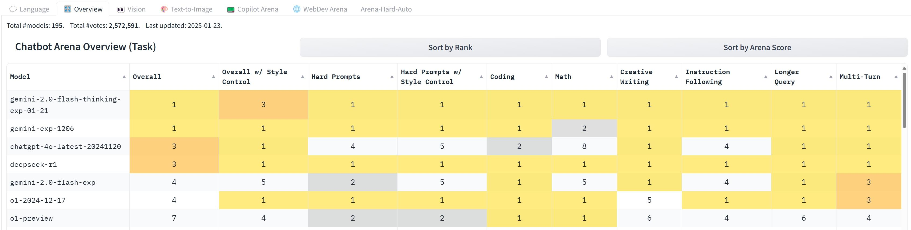

## 개요

:::info
**Paper:** DeepSeek-R1: Incentivizing Reasoning Capability in LLMs via Reinforcement Learning (arXiv:2501.12948, 2025.01)
**저자:** DeepSeek-AI
**소속:** DeepSeek (China, Hangzhou)
**모델:** [HuggingFace: deepseek-ai/DeepSeek-R1](https://huggingface.co/deepseek-ai/DeepSeek-R1)
**라이선스:** MIT
:::

2025년 1월 20일, DeepSeek-R1의 공개는 AI 연구사에서 가장 충격적인 사건 중 하나였다. 이 논문의 핵심 질문은 단순하면서도 근본적이다: **"LLM이 추론 능력을 지도 학습으로 '주입'받아야 하는가, 아니면 강화학습만으로 '스스로 발견'할 수 있는가?"**

기존 추론 모델, 특히 OpenAI o1은 대량의 SFT(Supervised Fine-Tuning) 데이터로 Chain-of-Thought 추론 패턴을 모델에 주입하는 방식이었다. DeepSeek-R1은 이 전제를 근본적으로 뒤집었다. **순수 강화학습(RL)만으로도 LLM이 자발적으로 복잡한 추론 전략을 "발견"할 수 있음을 실증**한 것이다. 더 나아가, 이 모든 것을 671B 파라미터 전체 가중치와 함께 MIT 라이선스로 오픈소스 공개하여, 추론 AI 연구의 민주화를 현실로 만들었다.

이 논문의 기여는 크게 네 가지로 요약된다.

1. **R1-Zero**: SFT 없이 순수 RL만으로 추론 능력이 창발하는 현상을 최초로 대규모 실증
2. **GRPO**: PPO 대비 효율적인 강화학습 알고리즘 제안 및 적용
3. **4단계 학습 파이프라인**: Cold Start SFT, Reasoning RL, Rejection Sampling SFT, Alignment RL의 체계적 설계
4. **증류(Distillation)**: 1.5B~70B 크기의 소형 모델로 추론 능력을 효과적으로 전이

## 배경 및 동기

### 추론 모델의 두 가지 경로

2024년 후반까지, LLM의 추론 능력을 강화하는 접근법은 크게 두 가지 흐름으로 발전해 왔다.

**Inference-time Scaling 경로**: [[test-time-compute-scaling]]에서 연구된 바와 같이, 추론 시점에 더 많은 연산을 투자하여 성능을 개선하는 접근이다. [[self-consistency]]의 다수결 투표, [[tree-of-thoughts]]의 탐색 기반 추론, [[67_scaling-test-time-compute]]의 체계적 스케일링 분석 등이 여기에 해당한다. 이 경로는 추론 시점의 연산량과 성능 사이의 스케일링 법칙을 활용한다.

**Training-time 경로**: OpenAI o1으로 대표되는 이 접근은, 대규모 CoT 데이터로 SFT를 수행한 후 RL로 정렬하는 방식이다. 모델이 "어떻게 생각해야 하는지"를 인간이 설계한 추론 패턴으로 직접 가르친다. 강력하지만, 고품질 추론 데이터 확보에 막대한 비용이 들며, 추론 패턴의 다양성이 데이터에 의해 제한된다.

### DeepSeek-R1의 근본적 질문

DeepSeek-R1은 두 번째 경로에 대해 근본적인 질문을 던진다. "SFT 데이터 없이, **보상 신호만으로** 모델이 추론 전략을 발견할 수 있는가?" 이 질문의 답이 긍정적이라면, 추론 AI의 개발 패러다임 자체가 바뀌게 된다. 인간이 일일이 추론 패턴을 설계하고 데이터를 만들 필요가 없어지기 때문이다.

이 질문에 답하기 위해, 논문은 먼저 극단적인 실험인 R1-Zero를 수행한다. 그리고 R1-Zero에서 발견된 가능성과 한계를 기반으로, 실용적인 DeepSeek-R1을 설계한다.

## 핵심 아이디어: GRPO 알고리즘

### PPO의 한계와 GRPO의 제안

대규모 언어 모델의 강화학습에서 가장 널리 사용되는 알고리즘은 PPO(Proximal Policy Optimization)다. PPO는 정책(policy)과 별도의 **가치 함수(value function)**를 함께 학습하여, 각 토큰 생성의 이점(advantage)을 추정한다.

$$A^{PPO}(s, a) = r(s, a) + \gamma V(s') - V(s)$$

여기서 $V(s)$는 가치 함수의 추정값이다. 문제는 이 가치 함수가 정책 모델과 **동일한 크기의 별도 모델**을 요구한다는 점이다. 671B 파라미터의 DeepSeek-V3에 PPO를 적용하면, 가치 함수만으로도 동일한 671B 파라미터의 메모리와 연산이 추가로 필요하다.

### GRPO의 핵심 메커니즘

GRPO(Group Relative Policy Optimization)는 이 문제를 우아하게 해결한다. 가치 함수를 완전히 제거하고, **그룹 내 상대 비교**로 이점을 추정한다.

각 질문 $q$에 대해 현재 정책 $\pi_{\theta_{old}}$로 $G$개의 응답 $\{o_1, o_2, \ldots, o_G\}$를 샘플링한다. 각 응답의 보상 $r_i$를 계산한 후, 그룹 내 정규화로 이점을 추정한다:

$$\hat{A}_i = \frac{r_i - \text{mean}(\{r_1, \ldots, r_G\})}{\text{std}(\{r_1, \ldots, r_G\})}$$

최종 GRPO 목적함수는 다음과 같다:

$$\mathcal{J}_{GRPO}(\theta) = \mathbb{E}_{q, \{o_i\}} \left[ \frac{1}{G} \sum_{i=1}^{G} \min\left(\frac{\pi_\theta(o_i|q)}{\pi_{\theta_{old}}(o_i|q)} \hat{A}_i, \; \text{clip}\left(\frac{\pi_\theta(o_i|q)}{\pi_{\theta_{old}}(o_i|q)}, 1-\epsilon, 1+\epsilon\right) \hat{A}_i \right) - \beta \, D_{KL}(\pi_\theta \| \pi_{ref}) \right]$$

여기서 클리핑은 PPO와 동일하게 정책 업데이트의 안정성을 보장하며, KL 발산 항은 참조 정책(reference policy)에서 과도하게 벗어나는 것을 방지한다.

### PPO vs GRPO 비교

| 항목 | PPO | GRPO |
|------|-----|------|
| 가치 함수 | 필요 (정책과 동일 크기) | 불필요 |
| 이점 추정 | $V(s)$ 기반 temporal difference | 그룹 내 상대 비교 |
| 메모리 오버헤드 | 높음 (2x 모델 크기) | 낮음 (1x 모델 크기) |
| 학습 안정성 | 가치 함수 학습 불안정 가능 | 그룹 통계 기반으로 안정적 |
| 대규모 모델 적합성 | 제한적 | 우수 |

*Figure 1: GRPO와 PPO의 학습 곡선 비교. GRPO(초록)는 PPO(파랑, 파란색 두 설정) 대비 학습 초기부터 일관되게 높은 정확도를 보이며, 수렴 속도도 더 빠르다. 가치 함수 없이도 그룹 상대 비교만으로 충분히 효과적인 이점 추정이 가능함을 보여준다. (DeepSeek-AI, 2025)*

## R1-Zero: 추론의 창발

### SFT 없는 순수 RL 실험

논문의 가장 혁신적이고 놀라운 결과는 R1-Zero에서 나온다. DeepSeek-V3 Base(사전학습만 완료된 모델, SFT/RLHF 없음)에 **어떤 지도 학습도 적용하지 않고** 직접 GRPO를 적용한 것이다.

보상 함수는 극도로 단순하게 설계되었다:

| 보상 유형 | 조건 | 보상값 | 목적 |
|----------|------|--------|------|
| 정확도 보상 | 최종 답변이 정답 | +1.0 | 올바른 추론 유도 |
| 정확도 보상 | 최종 답변이 오답 | -1.0 | 오류 억제 |
| 형식 보상 | `<think>...</think>` 태그 사용 | 소량의 양수 | 추론 과정 외부화 유도 |

이것이 전부다. "어떤 단계로 생각하라", "이런 추론 패턴을 따르라" 같은 지시도, CoT 예시도, 추론 패턴 데이터도 일절 없다. 오직 **"맞으면 보상, 틀리면 벌점, 생각 과정을 보여주면 약간의 보상"**이라는 신호만으로 학습한다.

### 창발적 추론 행동

놀랍게도, 이 단순한 보상만으로 다음과 같은 고급 추론 행동이 자발적으로 출현했다.

**1. Self-verification (자기 검증)**: 답을 구한 후 "이게 맞나?" 스스로 검증하고, 문제가 발견되면 처음부터 다시 시도한다. 이는 [[process-reward-models]]에서 외부적으로 구현하려는 검증 메커니즘을 모델이 내부적으로 자발 발견한 것이다.

**2. Reflection (반성)**: "Wait, I made an error here" 같은 메타인지적 발화를 통해 자신의 추론 오류를 인식하고 수정한다. 이는 단순한 오류 정정이 아니라, 자신의 추론 과정 자체를 모니터링하는 **메타인지(metacognition)** 능력의 출현이다.

**3. Extended thinking (확장 사고)**: 어려운 문제에 대해 점진적으로 더 긴 추론 체인을 생성한다. 학습이 진행될수록 평균 추론 토큰 수가 수백에서 수천으로 증가하며, 이는 [[test-time-compute-scaling]]의 핵심 원리가 RL을 통해 자연스럽게 학습된 것이다.

### "Aha Moment" -- 가장 놀라운 발견

논문에서 가장 인상적으로 보고되는 현상은 이른바 **"Aha Moment"**다. 학습 중간 단계에서, R1-Zero는 다음과 같은 추론 체인을 생성하기 시작했다:

> "Hmm, wait, I think I need to reconsider. Let me re-examine this step..."
> "Aha, I see the issue now. The previous approach was wrong because..."

이 "Aha" 패턴은 인간이 프로그래밍하거나 데이터로 주입한 것이 아니다. 모델이 **문제를 더 잘 풀기 위한 전략으로서** 자기 수정과 재고를 자발적으로 발견한 것이다. 이는 RL의 보상 압력이 충분히 강하면, 모델이 추론 전략을 "발명"할 수 있음을 시사한다.

### 언어 혼합(Language Mixing) 현상

R1-Zero의 또 다른 흥미로운 창발 현상은 **언어 혼합**이다. `<think>` 태그 내에서 영어와 중국어를 자유롭게 섞어 사용하는 경향이 나타났다. 예를 들어, 수학 용어는 영어로, 전략적 사고는 중국어로 표현하는 식이다.

이 현상은 두 가지 해석이 가능하다.

- **긍정적 해석**: 모델이 가장 효율적인 사고 표현 방식을 자율적으로 선택한 것
- **부정적 해석**: 출력의 가독성과 일관성이 심각하게 저하되어 실용성이 떨어짐

결국 이 언어 혼합 문제가 R1-Zero를 실용 모델로 직접 사용하기 어렵게 만드는 핵심 한계가 되었고, 이를 해결하기 위한 체계적인 학습 파이프라인의 설계, 즉 DeepSeek-R1의 개발 동기가 되었다.

### R1-Zero의 한계 정리

| 한계 | 설명 | 영향 |
|------|------|------|
| 언어 혼합 | 영어/중국어 무작위 혼용 | 가독성 저하, 일관성 부족 |
| 형식 불안정 | `<think>` 태그 깨짐/불일관 | 파싱 및 후처리 어려움 |
| 가독성 부족 | 추론 과정이 인간이 읽기 어려운 형태 | 디버깅/해석 불가 |
| 일반 대화 능력 부재 | 수학/코드 추론만 강화 | 실제 서비스 투입 불가 |

## DeepSeek-R1: 4단계 학습 파이프라인

R1-Zero의 발견("RL만으로 추론이 창발한다")을 기반으로, 그 한계("실용적이지 않다")를 극복하기 위해, DeepSeek-R1은 체계적인 **4단계 학습 파이프라인**을 설계했다.

### Stage 1: Cold Start SFT (소량 지도 학습)

R1-Zero의 불안정성 문제를 해결하기 위한 첫 번째 단계다. **수천 개의 고품질 CoT 예시**로 초기 SFT를 수행한다.

Cold Start 데이터의 구성:
- R1-Zero가 생성한 추론 체인 중 가독성이 높고 정답인 것을 선별
- 인간이 직접 작성한 고품질 CoT 예시 일부 포함
- 일관된 언어(영어 또는 중국어)로 작성된 것만 선별

:::warning
**핵심 포인트:** Cold Start는 추론 능력을 "가르치는" 것이 아니다. R1-Zero가 이미 발견한 추론 능력을 **길들이는(taming)** 역할을 한다. 구체적으로는, 일관된 언어 사용, 안정적인 `<think>...</think>` 형식, 가독성 높은 추론 표현을 학습시켜 후속 RL의 시작점을 개선한다.
:::

### Stage 2: Reasoning RL (대규모 강화학습)

Cold Start 이후, GRPO를 사용한 대규모 RL 학습을 수행한다. 이 단계에서 모델의 추론 능력이 비약적으로 향상된다.

보상 설계의 핵심 원칙:

| 도메인 | 보상 유형 | 설계 원칙 |
|--------|----------|----------|
| 수학 | 정확도 기반 | 정답 여부로 자동 판정 (deterministic) |
| 코드 | 테스트 통과 기반 | 테스트 케이스 통과 수로 판정 |
| 일반 추론 | 결과 기반 | [[process-reward-models]] 없이, 최종 결과만으로 보상 |
| 형식/언어 | 일관성 보상 | 언어 혼합 방지, 형식 준수 보상 |

여기서 주목할 점은 프로세스 보상 모델(PRM)을 **의도적으로 사용하지 않았다**는 것이다. [[66_lets-verify]]에서 연구된 PRM은 추론의 각 단계를 개별적으로 평가하지만, DeepSeek 팀은 PRM이 보상 해킹(reward hacking)에 취약하고 대규모 RL에서 유지보수가 어렵다고 판단했다. 대신, 최종 결과만으로 보상을 주는 Outcome-based Reward Model (ORM) 방식을 채택하여 단순성과 확장성을 확보했다.

### Stage 3: Rejection Sampling + SFT

Stage 2에서 학습된 강력한 추론 모델을 활용하여 **대규모 합성 데이터**를 생성하는 단계다.

과정:
1. 수학/코드/과학 문제에 대해 다수의 답변을 생성 (temperature sampling)
2. 정답인 답변만 선별 (rejection sampling)
3. 선별된 추론 데이터 + 일반 지시 따르기(instruction following) 데이터를 결합하여 SFT

이 단계의 핵심 목적은 **RL로 획득한 추론 능력을 일반 대화 능력과 통합**하는 것이다. Stage 2까지의 모델은 수학/코드 추론에서 매우 강력하지만, 일반적인 대화, 창작, 요약 등에서 성능이 저하된다. Rejection Sampling SFT는 추론 능력을 유지하면서 범용성을 회복시킨다.

### Stage 4: Alignment RL (정렬 강화학습)

최종 단계에서 RLHF를 적용하여 인간 선호도에 맞게 정렬한다.

정렬 보상의 구성:
- **안전성(Safety)**: 유해 콘텐츠 생성 억제
- **유용성(Helpfulness)**: 응답의 실질적 도움 정도
- **형식 품질**: 마크다운, 코드 블록 등의 적절한 형식 사용

이 단계는 모델을 실제 서비스에 배포할 수 있는 수준으로 다듬는 역할을 한다.

### 4단계 파이프라인 요약

| 단계 | 입력 | 방법 | 목적 | 핵심 효과 |
|------|------|------|------|----------|
| Stage 1 | DeepSeek-V3 Base | Cold Start SFT | 형식/언어 안정화 | RL의 시작점 개선 |
| Stage 2 | Stage 1 모델 | GRPO (대규모 RL) | 추론 능력 극대화 | 수학/코드 추론 비약적 향상 |
| Stage 3 | Stage 2 모델 | Rejection Sampling + SFT | 범용성 회복 | 추론 + 대화 능력 통합 |
| Stage 4 | Stage 3 모델 | Alignment RL (RLHF) | 안전성/유용성 정렬 | 서비스 배포 가능 수준 |

## 실험 결과 및 벤치마크 분석

### 주요 벤치마크 결과

DeepSeek-R1은 수학, 코딩, 과학 추론 등 주요 벤치마크에서 OpenAI o1-1217과 대등하거나 우위의 성능을 달성했다.

| 벤치마크 | 도메인 | DeepSeek-R1 | OpenAI o1-1217 | Claude 3.5 Sonnet | GPT-4o |
|----------|--------|-------------|----------------|-------------------|--------|
| AIME 2024 | 수학 경시대회 | **79.8%** | 79.2% | 16.0% | 9.3% |
| MATH-500 | 수학 문제 풀이 | **97.3%** | 96.4% | 78.3% | 74.6% |
| Codeforces | 코딩 대회 (Elo) | **2029** | 2061 | 717 | 759 |
| GPQA Diamond | PhD 수준 과학 | 71.5% | **75.7%** | 65.0% | 49.9% |
| MMLU | 종합 지식 | 90.8% | **91.8%** | 88.3% | 87.2% |
| LiveCodeBench | 실시간 코딩 | **65.9%** | 63.4% | - | - |
| SWE-Bench | 소프트웨어 엔지니어링 | **49.2%** | 48.9% | - | - |

### AIME 2024 심층 분석

AIME(American Invitational Mathematics Examination)은 미국 수학 경시대회로, 15문제를 3시간 내에 풀어야 하는 고난도 시험이다. DeepSeek-R1의 79.8%는 15문제 중 약 12문제를 정확히 풀었다는 의미로, 이는 인간 수학 경시대회 참가자 중에서도 상위권에 해당하는 성적이다.

특히 주목할 점은 pass@1 성능이다. R1은 한 번의 시도로 79.8%를 달성하지만, 다수 샘플링 후 합의를 통해(consensus@64) **97.3%**까지 끌어올릴 수 있다. 이는 [[self-consistency]]의 원리가 DeepSeek-R1에서도 효과적으로 작동함을 보여준다.

### Codeforces 성능 분석

Codeforces Elo 2029는 상위 약 3%에 해당하는 "Candidate Master" 수준이다. 이는 오픈소스 모델로서는 전례 없는 코딩 경쟁 성능이며, 폐쇄형 모델인 o1-1217(Elo 2061)에 근접한다. 코딩 태스크에서 R1이 보여주는 강점은 복잡한 알고리즘 설계와 다단계 논리 구성 능력에 기인한다.

### Chatbot Arena 성과

*Figure 2: LMSys Chatbot Arena 리더보드 (2025.01). DeepSeek-R1은 Arena Score 1316으로 4위를 기록했으며, MIT 라이선스 오픈소스 모델로서 최초로 상위 5위에 진입했다. 상위 3개 모델은 모두 Proprietary 라이선스인 반면, R1은 유일하게 MIT 오픈소스다. (LMSys, 2025)*

*Figure 3: Chatbot Arena 태스크 카테고리별 순위. DeepSeek-R1은 Math에서 1위, Hard Prompts에서 1위를 차지하며 추론 집약적 태스크에서 압도적 강점을 보인다. Creative Writing과 Multi-Turn에서는 상대적으로 순위가 낮아, 추론 특화 모델의 특성이 드러난다. (LMSys, 2025)*

Chatbot Arena 결과는 R1의 강점과 약점을 명확히 드러낸다. 수학과 어려운 프롬프트에서는 최상위이지만, 창작과 다중 턴 대화에서는 다른 모델에 뒤진다. 이는 RL 보상이 추론 과제에 집중되어 있기 때문이며, Stage 3-4의 정렬 학습으로도 완전히 보완되지 않는 구조적 한계를 시사한다.

### 추론 비용 효율성

R1의 MoE(Mixture of Experts) 아키텍처는 추론 비용에서 현격한 이점을 제공한다.

| 항목 | DeepSeek-R1 | OpenAI o1 (추정) |
|------|------------|------------------|
| 총 파라미터 | 671B | 비공개 (추정 1T+) |
| 활성 파라미터/토큰 | 37B | 비공개 |
| API 가격 (입력) | $0.55/1M tokens | $15.00/1M tokens |
| API 가격 (출력) | $2.19/1M tokens | $60.00/1M tokens |
| 가격 비율 | 1x | ~27x (입력), ~27x (출력) |

671B 파라미터 중 토큰당 37B만 활성화되는 MoE 구조 덕분에, R1은 동일 추론 품질을 **o1 대비 약 1/27의 비용**으로 제공한다. 이 극적인 가격 차이는 R1의 오픈소스 공개와 결합하여, 추론 AI의 접근성을 근본적으로 변화시켰다.

## 증류 전략: 추론의 민주화

### 증류 방법론

DeepSeek-R1의 또 다른 핵심 기여는 **증류(distillation)** 전략이다. 671B의 R1을 교사(teacher) 모델로 활용하여, 1.5B부터 70B까지 다양한 크기의 학생(student) 모델을 학습시켰다.

증류 과정은 단순하다:
1. R1이 대량의 문제에 대해 추론 체인 + 답변을 생성
2. 정답인 응답만 선별
3. 선별된 데이터로 학생 모델을 SFT

핵심은 학생 모델이 R1의 **추론 과정 자체(사고의 패턴, 자기 검증, 반성)를 모방 학습**한다는 점이다. 이는 단순한 지식 증류(knowledge distillation)를 넘어, **추론 능력의 증류(reasoning distillation)**라고 할 수 있다.

### 증류 모델 성능

| 학생 모델 | 기반 아키텍처 | 파라미터 | AIME 2024 | MATH-500 | GPQA Diamond | LiveCodeBench |
|----------|-------------|---------|-----------|----------|-------------|---------------|
| R1-Distill-Qwen-1.5B | Qwen2.5-1.5B | 1.5B | 28.9% | 83.9% | - | - |
| R1-Distill-Qwen-7B | Qwen2.5-7B | 7B | 55.5% | 92.8% | 49.1% | 37.6% |
| R1-Distill-LLaMA-8B | LLaMA-3.1-8B | 8B | 50.4% | 89.1% | 49.0% | - |
| R1-Distill-Qwen-14B | Qwen2.5-14B | 14B | 69.7% | 93.9% | 59.1% | 53.1% |
| R1-Distill-Qwen-32B | Qwen2.5-32B | 32B | 72.6% | 94.3% | 62.1% | 57.2% |
| R1-Distill-LLaMA-70B | LLaMA-3.1-70B | 70B | 70.0% | 94.5% | 65.2% | 57.5% |

### 증류 vs 직접 RL: 핵심 발견

:::tip
**핵심 발견:** 동일 크기의 모델에서, **직접 RL을 적용하는 것보다 R1으로부터의 증류가 더 높은 성능**을 달성했다. 이는 소형 모델의 추론 능력 확보에서 증류의 우위를 명확히 보여준다.
:::

7B 모델에서의 직접 비교:

| 방법 | AIME 2024 | MATH-500 |
|------|-----------|----------|
| Qwen2.5-7B + 직접 RL (GRPO) | 47.3% | 87.0% |
| **R1-Distill-Qwen-7B (증류)** | **55.5%** | **92.8%** |
| 차이 | +8.2%p | +5.8%p |

이 결과는 중요한 시사점을 가진다. 소형 모델(7B)이 자체적으로 RL을 통해 추론 능력을 학습하는 것보다, 대형 모델(671B)의 추론 체인을 모방하는 것이 더 효율적이다. 이는 소형 모델의 capacity가 복잡한 추론 전략을 RL로 직접 발견하기에는 부족하지만, 이미 발견된 전략을 모방 학습하기에는 충분하다는 것을 의미한다.

### 1.5B 모델의 혁명적 의미

R1-Distill-Qwen-1.5B는 **1.5B 파라미터로 AIME 2024에서 28.9%**를 달성했다. 이 수치의 의미를 맥락화하면 다음과 같다.

- GPT-4 (초기 버전, 2023): AIME에서 약 20~30% 수준으로 추정
- 1.5B 파라미터: 스마트폰에서 실행 가능한 크기
- MATH-500에서 83.9%: 대부분의 고등학교 수학 문제를 정확히 풀 수 있는 수준

스마트폰 크기의 모델이 GPT-4급 수학 추론 능력을 보여준다는 것은, 추론 AI의 접근성 측면에서 혁명적이다. 인터넷 연결 없이도, 개인 디바이스에서 고품질 수학 추론이 가능해진다는 의미이기 때문이다.

## 한계 및 미해결 과제

### 1. 일반 지식 vs 추론의 트레이드오프

R1은 수학/코드 추론에서 탁월하지만, 일반 상식이나 사실 기반 질문에서는 기존 대형 모델(GPT-4o, Claude 3.5)에 미치지 못한다. Chatbot Arena의 태스크별 분석에서도 Creative Writing과 Multi-Turn에서 순위가 낮은 것이 이를 뒷받침한다. RL 보상이 수학/코드의 정확도에 집중되어 있어, 일반 능력이 상대적으로 희생된 것으로 보인다.

### 2. 보상 해킹(Reward Hacking) 위험

RL 학습의 근본적 위험인 보상 해킹이 R1에서도 잠재적으로 존재한다. 모델이 실제로 깊이 있는 추론을 수행하는 것이 아니라, 보상을 최대화하는 표면적 패턴(예: 특정 형식의 답변 구조, 키워드 반복)을 학습할 가능성이 있다. 논문에서는 이 위험을 인정하면서도, 벤치마크 성능의 일관된 향상이 실질적 추론 능력의 개선을 반영한다고 주장한다.

### 3. 추론 체인의 환각(Reasoning Hallucination)

R1은 때때로 **자신감 있게 잘못된 추론 체인**을 생성한다. 각 단계가 논리적으로 보이지만 전체 추론이 잘못된 방향으로 진행되는 "coherent but incorrect" 패턴이다. 긴 추론 과정이 반드시 정확한 답을 보장하지 않으며, 추론 체인의 신뢰성 검증은 여전히 열린 문제다.

### 4. 재현의 현실적 어려움

논문은 학습 방법론을 상세히 공개하지만, 실제 재현에는 상당한 장벽이 존재한다.

- DeepSeek-V3 Base 수준의 사전학습 모델 구축에 수천 GPU-일 소요
- GRPO 학습을 위한 대규모 GPU 클러스터 필요
- 보상 함수의 세밀한 튜닝 노하우가 논문에 완전히 공개되지 않음

따라서 R1의 "증류 모델"이 실질적으로 더 중요한 기여일 수 있다. 대부분의 연구 그룹과 기업은 R1을 처음부터 재현하는 것보다, 공개된 증류 모델을 기반으로 연구를 진행하는 것이 현실적이다.

### 5. 안전성(Safety) 우려

중국에서 개발된 모델이라는 점에서 안전성과 검열에 대한 우려가 제기되었다. 특히 정치적으로 민감한 주제에 대한 응답에서 특정 편향이 관찰되었다는 보고가 있다. 이는 Stage 4 Alignment RL에서의 보상 설계가 반영된 결과로 추정되며, 오픈소스 모델이기 때문에 커뮤니티에서 이를 감지하고 분석할 수 있다는 점이 오히려 투명성의 이점이 된다.

## 의의 및 후속 연구

### 패러다임 전환: RL로 추론이 창발한다

R1-Zero의 결과는 AI 연구에서 가장 중요한 발견 중 하나다. LLM에 **올바른 인센티브(보상)만 주어지면 자발적으로 추론 전략을 발견**할 수 있다는 것은, 인간이 일일이 추론 패턴을 설계하고 데이터화할 필요가 없다는 의미다. 이는 [[reasoning-vs-inference]]의 근본적 질문에 대해 새로운 관점을 제공한다.

### 오픈소스 추론 AI의 출발점

MIT 라이선스로 가중치, 증류 모델, 학습 방법론을 모두 공개한 것은 추론 AI 연구의 진입 장벽을 극적으로 낮췄다. R1 공개 이후, 커뮤니티에서는 다양한 후속 연구가 폭발적으로 진행되었다.

- **Open-source reasoning 생태계**: R1 증류 모델을 기반으로 한 추가 파인튜닝, 도메인 특화 등
- **GRPO 확산**: R1이 증명한 GRPO의 효과로, 다수의 후속 연구가 PPO 대신 GRPO를 채택
- **소형 추론 모델**: 1.5B~7B 크기의 추론 특화 모델 연구 활성화

### RL + SFT의 최적 조합

R1의 4단계 파이프라인은 RL과 SFT가 **상호 배타적이 아니라 상호 보완적**임을 실증했다. RL이 추론 능력을 "발견"하고, SFT가 그것을 "안정화/다듬는" 구조는 향후 추론 모델 개발의 표준 패러다임으로 자리잡고 있다.

| 역할 | RL | SFT |
|------|-----|------|
| 추론 능력 | 발견/강화 | 안정화/형식화 |
| 대화 능력 | 부재/약화 | 회복/통합 |
| 안전성 | 보상 해킹 위험 | 데이터 기반 정렬 |
| 상호 관계 | SFT가 RL의 시작점 개선 | RL이 SFT의 교사 데이터 생성 |

### DeepSeek-R1이 남긴 질문들

R1은 많은 것을 해결하면서도, 동시에 새로운 질문들을 열었다.

1. **스케일링**: R1-Zero의 창발 현상은 더 큰 모델에서 더 강해지는가? 더 작은 모델에서도 가능한가?
2. **도메인 확장**: 수학/코드 외의 도메인(법률, 의료, 창작)에서도 RL 기반 추론 창발이 가능한가?
3. **추론 효율성**: 긴 추론 체인 없이도 동일한 정확도를 달성하는 방법은 없는가?
4. **멀티모달 추론**: 이미지, 비디오 등 멀티모달 입력에 대해서도 RL 기반 추론이 창발할 수 있는가?

## 결론

DeepSeek-R1은 세 가지 차원에서 AI 연구에 근본적 기여를 했다.

**과학적 기여**: R1-Zero를 통해, 순수 RL만으로 LLM에서 복잡한 추론 능력이 자발적으로 창발할 수 있음을 최초로 대규모 실증했다. 이는 "추론은 데이터로 가르쳐야 한다"는 기존 가정을 뒤집는 패러다임 전환이다.

**공학적 기여**: GRPO 알고리즘, 4단계 학습 파이프라인, 증류 전략 등 실용적인 방법론을 체계적으로 설계하고 검증했다. 이 파이프라인은 향후 추론 모델 개발의 표준 레시피로 활용될 수 있다.

**생태계적 기여**: 671B 전체 가중치를 MIT 라이선스로 공개하고, 1.5B~70B 증류 모델까지 제공함으로써, 추론 AI 연구의 진입 장벽을 극적으로 낮췄다. 이는 OpenAI o1의 폐쇄적 접근과 대비되며, 추론 AI의 민주화를 실현했다.

DeepSeek-R1은 단순히 "o1에 대적하는 오픈소스 모델"이 아니다. 이 논문은 **"LLM이 올바른 인센티브를 받으면 스스로 추론하는 법을 발견할 수 있다"**는 근본적 발견을 담고 있으며, 이 발견이 추론 AI 연구의 방향 자체를 바꾸고 있다.

## Paper Summary

| 항목 | 내용 |
|------|------|
| 제목 | DeepSeek-R1: Incentivizing Reasoning Capability in LLMs via Reinforcement Learning |
| 저자 | DeepSeek-AI |
| 소속 | DeepSeek (China) |
| 연도 | 2025 |
| 학회 | arXiv preprint |
| 원문 | [arXiv:2501.12948](https://arxiv.org/abs/2501.12948) |
| 모델 | [HuggingFace: deepseek-ai/DeepSeek-R1](https://huggingface.co/deepseek-ai/DeepSeek-R1) |
| 핵심 키워드 | Reinforcement Learning, GRPO, Emergent Reasoning, Chain-of-Thought, Distillation, Open Source, MoE |
