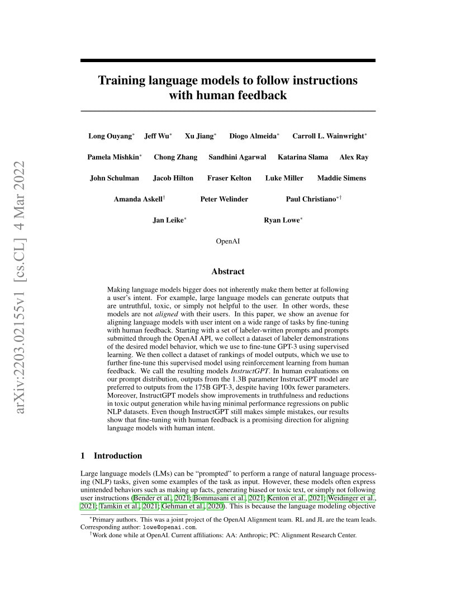

## 개요

"GPT-4 Technical Report"(OpenAI, 2023)는 텍스트와 이미지를 모두 입력으로 받아들이고 텍스트를 출력하는 대규모 멀티모달 모델 GPT-4를 소개한 기술 보고서입니다. GPT-4는 미국 변호사 시험(Uniform Bar Exam)에서 상위 약 10%에 해당하는 점수를 기록하고, 다양한 학술 벤치마크에서 기존 최고 성능을 뛰어넘는 결과를 달성했습니다.

이 보고서는 기존의 학술 논문과는 상당히 다른 형태를 취하고 있습니다. 모델 아키텍처, 학습 데이터, 하드웨어 구성 등의 상세 정보를 공개하지 않았으며, 이는 경쟁 환경과 안전성을 이유로 한 의도적인 결정이었습니다. 대신 모델의 **능력(capabilities)**과 **한계(limitations)**, 그리고 **안전성(safety)** 평가에 초점을 맞추고 있습니다.

GPT-4의 가장 중요한 기술적 성과 두 가지는 다음과 같습니다. 첫째, **예측 가능한 스케일링(Predictable Scaling)**으로, 1/10,000 수준의 소규모 모델로부터 최종 GPT-4의 성능을 정확하게 예측할 수 있는 인프라를 구축했습니다. 둘째, **RLHF 기반 정렬(Alignment)**을 통해 모델의 안전성과 유용성을 크게 개선했습니다.

## 배경 및 동기

### 대규모 언어 모델의 발전

GPT 시리즈는 "Generative Pre-trained Transformer"의 약자로, GPT-1(Radford et al., 2018)부터 시작된 OpenAI의 주력 모델 라인입니다. 각 세대별 발전을 정리하면 다음과 같습니다:

| 모델 | 연도 | 파라미터 | 핵심 기여 |
|------|------|---------|----------|
| GPT-1 | 2018 | 117M | 사전 학습 + 미세 조정 패러다임 확립 |
| GPT-2 | 2019 | 1.5B | 제로샷 학습의 가능성 제시 |
| GPT-3 | 2020 | 175B | 인컨텍스트 학습, Few-shot 능력 입증 |
| InstructGPT | 2022 | ~175B | RLHF를 통한 인간 선호도 정렬 |
| GPT-4 | 2023 | 비공개 | 멀티모달, 전문가 수준 추론 |

GPT-3([[gpt-3]])까지의 모델은 순수한 스케일링에 초점을 맞추었습니다. 그러나 InstructGPT([[instructgpt]])에서 RLHF(Reinforcement Learning from Human Feedback)를 도입하면서, 단순히 모델을 키우는 것만으로는 해결할 수 없는 정렬(alignment) 문제를 다루기 시작했습니다. GPT-4는 이 두 가지 축, 즉 **스케일링**과 **정렬**을 동시에 극대화한 결과물입니다.

### 멀티모달로의 확장

GPT-4 이전의 대규모 언어 모델은 텍스트만을 입력으로 처리했습니다. 그러나 인간의 지능은 본질적으로 멀티모달입니다. 텍스트, 이미지, 음성, 동영상 등 다양한 양식(modality)의 정보를 통합적으로 이해하고 추론합니다. GPT-4는 이 방향으로의 첫 번째 대규모 도약으로, 이미지와 텍스트를 동시에 입력받아 처리할 수 있는 **비전 언어 모델(Vision-Language Model)**로서의 면모를 갖추었습니다.

### 안전성과 예측 가능성의 중요성

대규모 모델이 점점 강력해지면서 안전성 문제가 더욱 부각되었습니다. GPT-3의 경우에도 편향된 출력, 유해한 콘텐츠 생성, 환각(hallucination) 등의 문제가 지적되었습니다. GPT-4 프로젝트에서는 이러한 문제를 체계적으로 다루기 위해 처음부터 안전성을 설계에 내재화하는 접근을 취했습니다.

또한 대규모 학습의 실용적 측면에서, 수백만 달러 규모의 학습 비용을 투입한 뒤에야 모델의 성능을 확인할 수 있다면 연구 효율성이 극히 낮아집니다. 이에 OpenAI는 **소규모 모델에서의 예측을 통해 대규모 모델의 성능을 사전에 추정**하는 인프라를 핵심 과제로 설정했습니다.

## 핵심 아이디어

### 예측 가능한 스케일링 (Predictable Scaling)

GPT-4의 가장 주목할 만한 기술적 성과 중 하나는 **예측 가능한 스케일링** 인프라입니다. OpenAI는 GPT-4의 최종 학습에 앞서, 1,000배에서 10,000배 이하의 연산량을 사용하는 소규모 모델들을 학습하여 GPT-4의 최종 손실(loss)을 정확하게 예측했습니다.

*Figure 1: GPT-4의 학습 손실 예측. 1/10,000에서 1/1,000 수준의 소규모 모델들로부터 GPT-4의 최종 학습 손실을 정확하게 예측한 결과. 소규모 실험의 멱법칙(power law)이 대규모 학습에서도 유지됨을 보여준다. (OpenAI, 2023)*

이 예측 가능성은 단순히 학술적 의미를 넘어 실용적으로 매우 중요합니다:

- **연구 효율성**: 대규모 학습 전에 성능을 사전 검증할 수 있어, 수백만 달러 규모의 실험 실패 위험을 줄입니다
- **자원 배분**: 주어진 예산으로 어느 정도의 성능을 기대할 수 있는지 사전에 계획할 수 있습니다
- **아키텍처 결정**: 여러 아키텍처 후보 중 최적의 선택을 소규모 실험으로 결정할 수 있습니다

:::info
멱법칙(Power Law) 스케일링은 Kaplan et al.(2020)의 스케일링 법칙([[scaling-laws]]) 연구에서 처음 체계적으로 분석되었습니다. GPT-4는 이를 실제 제품 수준의 예측 도구로 발전시킨 사례입니다.
:::

다만 이러한 예측이 **학습 손실(training loss)**에 대해서는 잘 작동하지만, 개별 태스크 성능에 대해서는 여전히 어려움이 있습니다. 논문에서는 일부 벤치마크(예: HumanEval의 Coding 문제)에 대해 로그 스케일 외삽이 가능함을 보여주지만, 모든 능력에 대해 이것이 일반적으로 성립하는지는 추가 연구가 필요합니다.

### 멀티모달 입력 처리

GPT-4는 텍스트뿐만 아니라 이미지를 입력으로 받아 처리할 수 있습니다. 이는 단순한 이미지 캡셔닝을 넘어, 이미지 내의 텍스트 읽기, 차트 해석, 다이어그램 이해, 유머 파악 등 복잡한 시각적 추론을 수행할 수 있음을 의미합니다.

*Figure 2: GPT-4의 시각적 입력 처리 능력. 차트, 그래프 등의 시각적 정보를 텍스트와 결합하여 이해하고 추론할 수 있다. (OpenAI, 2023)*

멀티모달 능력의 핵심 특징들을 정리하면 다음과 같습니다:

- **텍스트 인식**: 이미지 내의 텍스트를 정확하게 읽고 맥락에 맞게 해석
- **공간적 추론**: 객체의 위치, 크기, 관계를 이해
- **차트/그래프 해석**: 데이터 시각화를 분석하고 정량적 추론 수행
- **유머 이해**: 시각적 유머와 아이러니를 파악하는 고차원 추론

:::warning
GPT-4의 이미지 입력 능력은 초기 발표 시점에는 제한적으로 공개되었으며, 이후 GPT-4V(ision)로 별도 출시되었습니다. 보고서에서 보여준 이미지 관련 벤치마크 결과는 텍스트 전용 결과와는 별개로 평가되었습니다.
:::

### RLHF 기반 안전성 정렬

GPT-4의 안전성은 크게 두 단계로 달성됩니다:

1. **사전 학습 단계**: 학습 데이터의 필터링과 정제를 통해 모델이 학습하는 정보의 질을 관리합니다
2. **사후 학습 단계**: RLHF를 통해 모델의 출력을 인간의 선호도와 정렬합니다

RLHF 과정은 InstructGPT에서 처음 도입된 방법론을 확장한 것으로, 보상 모델(Reward Model)을 학습시키고 이를 기반으로 강화 학습을 수행합니다. GPT-4에서는 추가적으로 **규칙 기반 보상 모델(Rule-Based Reward Model, RBRM)**을 도입하여 안전성 관련 판단을 보다 체계적으로 수행합니다.

GPT-4의 안전성 개선을 보여주는 핵심 지표:

| 평가 항목 | GPT-4 (초기) | GPT-4 (RLHF 적용 후) | 개선율 |
|----------|-------------|-------------------|-------|
| 허용되지 않는 콘텐츠 요청 거부율 | 낮음 | 82% | 대폭 개선 |
| 사실성 (TruthfulQA) | GPT-3.5 대비 | 40% 향상 | 유의미 |
| 유해 콘텐츠 생성 | 높음 | 29% 감소 | 유의미 |

## 방법론

### 모델 아키텍처와 학습

GPT-4의 기술 보고서는 모델의 구체적인 아키텍처 세부사항을 공개하지 않았습니다. 보고서에서 밝힌 내용은 다음과 같습니다:

- **기반 아키텍처**: Transformer 기반
- **사전 학습 방식**: 다음 토큰 예측(Next Token Prediction)
- **학습 데이터**: 공개 데이터와 라이선스된 데이터의 혼합 (구체적 규모 미공개)
- **학습 인프라**: Microsoft Azure 기반의 슈퍼컴퓨터

이러한 비공개 정책은 AI 커뮤니티에서 상당한 논란을 불러일으켰습니다. "Open" AI라는 이름과 달리 핵심 기술 세부사항을 공개하지 않은 것은 경쟁 환경과 안전성을 이유로 설명되었지만, 재현성(reproducibility)과 학술적 검증 가능성을 저해한다는 비판도 있었습니다.

### 벤치마크 평가 전략

GPT-4의 평가는 크게 세 가지 차원에서 이루어졌습니다:

**1. 전문 시험 (Professional Exams)**

GPT-4의 가장 인상적인 결과 중 하나는 인간을 위해 설계된 전문 시험에서의 성과입니다.

*Figure 3: GPT-4와 GPT-3.5의 전문 시험 성적 비교. GPT-4는 미국 변호사 시험(Bar Exam)에서 상위 약 10%, SAT 수학에서 상위 약 11%에 해당하는 성적을 기록했다. 대부분의 시험에서 GPT-3.5를 크게 앞선다. (OpenAI, 2023)*

주요 시험 결과를 정리하면:

| 시험 | GPT-4 | GPT-3.5 | 인간 백분위 (GPT-4) |
|------|-------|---------|-------------------|
| Uniform Bar Exam (MBE+MEE+MPT) | ~298/400 | ~213/400 | 상위 ~10% |
| LSAT | ~163 | ~149 | 상위 ~12% |
| SAT Math | 700/800 | 590/800 | 상위 ~11% |
| SAT Reading & Writing | 710/800 | 670/800 | 상위 ~7% |
| GRE Quantitative | 163/170 | 157/170 | 상위 ~20% |
| AP Biology | 5 | 4 | 상위 ~15% |
| AP Chemistry | 4 | 2 | 상위 ~30% |

**2. 학술 벤치마크 (Academic Benchmarks)**

전통적인 NLP 벤치마크에서도 GPT-4는 우수한 성능을 보였습니다:

| 벤치마크 | GPT-4 | GPT-3.5 | 비고 |
|---------|-------|---------|-----|
| MMLU (5-shot) | 86.4% | 70.0% | 다양한 주제에 대한 객관식 |
| HellaSwag (10-shot) | 95.3% | 85.5% | 상식 추론 |
| AI2 ARC (25-shot) | 96.3% | 85.2% | 과학 지식 |
| WinoGrande (5-shot) | 87.5% | 81.6% | 상식 추론 |
| HumanEval (0-shot) | 67.0% | 48.1% | 코드 생성 |
| DROP (3-shot, F1) | 80.9% | 64.1% | 독해 추론 |

**3. 다국어 능력 (Multilingual Capability)**

GPT-4는 영어 이외의 언어에서도 뛰어난 성능을 보였습니다. MMLU 벤치마크를 26개 언어로 번역하여 평가한 결과, GPT-4는 24개 언어에서 GPT-3.5의 영어 성능을 초과했습니다. 이는 모델의 다국어 지식 전이 능력이 매우 강력함을 시사합니다.

*Figure 4: 다양한 언어에 대한 GPT-4의 MMLU 정확도. GPT-4는 대부분의 언어에서 GPT-3.5의 영어 성능(70.1%)을 초과한다. 라틴 문자 기반 유럽 언어에서 가장 높은 성능을 보이며, 저자원 언어에서도 준수한 결과를 달성한다. (OpenAI, 2023)*

### 스케일링 예측 인프라

OpenAI는 GPT-4의 학습에 앞서, 최종 성능을 예측하기 위한 체계적인 인프라를 구축했습니다. 이 인프라의 핵심은 **멱법칙(Power Law) 외삽**입니다.

구체적인 절차는 다음과 같습니다:

1. GPT-4와 동일한 방법론으로 다양한 크기의 소규모 모델을 학습합니다
2. 각 모델의 최종 학습 손실을 기록합니다
3. 연산량(compute) 대비 손실의 관계를 멱법칙으로 피팅합니다
4. 이 관계식을 GPT-4 규모로 외삽하여 예상 손실을 계산합니다

$$L(C) = aC^b + c$$

여기서 $L$은 학습 손실, $C$는 연산량, $a$, $b$, $c$는 피팅 파라미터입니다.

이 예측은 최종 학습 손실에 대해 매우 정확했으며, 일부 벤치마크(HumanEval 등)에 대해서도 로그 스케일에서의 외삽이 가능했습니다. 그러나 Inverse Scaling 현상(모델이 커지면 오히려 성능이 떨어지는 태스크)과 같은 비선형적 행동에 대해서는 여전히 예측이 어렵다는 한계가 있습니다.

### 안전성 파이프라인

GPT-4의 안전성 개선을 위해 OpenAI는 다층적인 접근을 취했습니다:

**1단계: 추가 안전 관련 RLHF 학습 데이터**

안전 관련 프롬프트를 추가로 수집하고, 이에 대한 인간 평가자의 선호도 데이터를 기반으로 보상 모델을 학습했습니다.

**2단계: 규칙 기반 보상 모델 (RBRM)**

안전 관련 판단을 위한 별도의 분류기를 학습하여, 모델의 출력이 정책을 위반하는지 자동으로 평가합니다. 이는 인간 평가자만으로는 확장할 수 없는 평가 과정을 자동화합니다.

**3단계: 레드 팀(Red Team) 평가**

50명 이상의 외부 전문가를 동원하여 적대적 테스트를 수행했습니다. 레드 팀의 전문 분야는 사이버 보안, 생물 위험, 국제 안보, 정치적 편향 등을 포함합니다.

:::tip
GPT-4의 안전성 접근 방식은 이후 대부분의 주요 LLM 개발사에서 표준으로 채택되었습니다. Llama 3([[llama-3]]), Claude, Gemini([[gemini]]) 등 모든 주요 모델이 유사한 다층적 안전성 파이프라인을 사용하고 있습니다.
:::

### 시각적 입력 평가

GPT-4의 비전 능력은 다양한 멀티모달 벤치마크에서 평가되었습니다:

| 벤치마크 | GPT-4 | 이전 SOTA | 비고 |
|---------|-------|----------|-----|
| VQAv2 | 77.2% | - | 시각적 질의응답 |
| TextVQA | 78.0% | - | 텍스트 포함 이미지 QA |
| ChartQA | 78.5% | - | 차트 이해 |
| AI2D | 78.2% | - | 과학 다이어그램 |
| DocVQA | 88.4% | - | 문서 이해 |

특히 의료 영상, 과학 다이어그램, 복잡한 차트 등 전문 영역에서의 성능이 주목할 만합니다. 이는 GPT-4가 단순한 이미지 인식을 넘어 **전문적 시각 추론**이 가능함을 시사합니다.

## 실험 결과

### 능력의 깊이와 폭

GPT-4의 실험 결과에서 가장 두드러지는 점은 능력의 **폭(breadth)**입니다. 단일 태스크에서의 극단적 성능보다는, 매우 다양한 영역에서 일관되게 높은 성능을 보인다는 것이 핵심입니다.

특히 주목할 만한 결과들:

- **법률**: Bar Exam에서 상위 10% — 이는 실제 변호사 자격 취득에 충분한 수준
- **의학**: USMLE(미국 의사 자격시험) 관련 문제에서 합격 수준 이상
- **코딩**: HumanEval에서 67% — 실용적 코드 생성이 가능한 수준
- **수학**: AMC 12에서 30/150 이상 — 고등학생 수학 경시대회 수준

### Calibration (보정) 특성

GPT-4의 사전 학습 모델은 자신의 예측에 대한 보정(calibration)이 매우 잘 되어 있습니다. 즉, 모델이 95% 확신한다고 말한 답변은 실제로 약 95% 정도의 확률로 정답입니다. 그러나 RLHF 적용 후 이 calibration이 다소 저하되는 현상이 관찰되었습니다.

*Figure 5: GPT-4의 calibration 특성. 사전 학습 모델(왼쪽)은 예측 확률과 실제 정답률이 거의 일치하는 우수한 보정을 보여주지만, RLHF 적용 후(오른쪽) 보정 품질이 저하된다. 이는 RLHF가 모델의 불확실성 표현에 영향을 미침을 시사한다. (OpenAI, 2023)*

이는 중요한 시사점을 가집니다:

- 사전 학습된 LLM은 자신의 불확실성을 상당히 잘 표현할 수 있습니다
- RLHF는 안전성과 유용성을 개선하지만, calibration이라는 부작용을 동반할 수 있습니다
- 실제 배포 환경에서는 이러한 calibration 저하를 고려한 추가적인 불확실성 정량화가 필요합니다

### GPT-3.5 대비 개선

GPT-4와 GPT-3.5의 가장 큰 차이는 복잡한 추론 능력에서 나타납니다. 간단한 대화나 요약에서는 차이가 크지 않지만, 다단계 추론, 복잡한 지시 사항 준수, 미묘한 맥락 이해에서 GPT-4가 확연히 우수합니다.

OpenAI 내부 평가(Capped Elo 기준)에서의 비교:

| 카테고리 | GPT-4 Elo | GPT-3.5-Turbo Elo | 차이 |
|---------|----------|------------------|-----|
| 전체 | 1,260 | 1,100 | +160 |
| 추론 | 1,280 | 1,060 | +220 |
| 코딩 | 1,275 | 1,080 | +195 |
| 창작 | 1,230 | 1,120 | +110 |

추론과 코딩에서의 격차가 특히 크다는 점이 주목됩니다. 이는 GPT-4가 단순한 패턴 매칭을 넘어 보다 깊은 논리적 추론 능력을 갖추었음을 시사합니다.

### 안전성 평가 결과

GPT-4의 안전성 평가는 **RealToxicityPrompts**, **TruthfulQA**, 그리고 내부 평가 세트를 통해 수행되었습니다:

- **RealToxicityPrompts**: 유해 콘텐츠 생성 비율이 GPT-3.5 대비 감소
- **TruthfulQA**: 사실성이 GPT-3.5 대비 약 40% 향상
- **내부 적대적 프롬프트**: 허용되지 않는 콘텐츠 요청에 대한 거부율 82% 달성

:::danger
GPT-4도 여전히 환각(hallucination) 문제에서 자유롭지 않습니다. 보고서에서도 이를 "가장 큰 한계 중 하나"로 명시하고 있으며, "항상 정확한 것은 아니다"라는 점을 강조합니다. 실제 사용 시에는 출력에 대한 검증이 필수적입니다.
:::

## 한계 및 의의

### 한계

**1. 환각 (Hallucination)**

GPT-4는 이전 모델보다 환각이 줄었지만 여전히 존재합니다. OpenAI 내부 평가에서 GPT-4는 TruthfulQA 벤치마크에서 GPT-3.5 대비 약 40% 높은 사실 정확도를 보였지만, 완전한 해결과는 거리가 멉니다. 특히 모델이 자신감 있게 틀린 답변을 제공하는 경우가 문제적입니다.

**2. 학습 데이터 컷오프**

GPT-4의 학습 데이터는 2021년 9월까지로 제한됩니다. 이후의 사건이나 발전에 대한 지식이 없으며, 이는 시간에 민감한 질문에서 한계를 보입니다.

**3. 긴 맥락에서의 성능 저하**

보고서에서는 매우 긴 문맥에서 모든 정보를 균등하게 활용하지 못하는 경향이 있음을 인정합니다. 이는 이후 "Lost in the Middle"(Liu et al., 2023) 등의 연구에서 더 자세히 분석됩니다.

**4. 투명성 부족**

아키텍처, 학습 데이터, 하드웨어 구성 등 핵심 정보를 공개하지 않아 학술적 재현과 검증이 불가능합니다. 이는 "기술 보고서"라는 형식의 한계이기도 합니다.

**5. 비용과 접근성**

GPT-4는 GPT-3.5 대비 상당히 높은 추론 비용을 요구하며, 이는 일반 사용자와 연구자의 접근성을 제한합니다.

### 의의

**1. 대규모 AI 모델의 이정표**

GPT-4는 "인간 수준의 전문가 성능"이라는 수사가 처음으로 다양한 영역에서 실질적으로 뒷받침된 모델입니다. 변호사 시험, 의사 시험 등에서의 성과는 AI의 실용적 잠재력을 구체적으로 보여줍니다.

**2. 예측 가능한 스케일링의 실증**

소규모 실험에서 대규모 성능을 예측할 수 있다는 것은 AI 연구 방법론의 중요한 발전입니다. 이는 이후 [[chinchilla]]의 스케일링 법칙 연구와 함께 AI 개발의 과학적 기반을 강화합니다.

**3. 멀티모달 AI의 대중화**

GPT-4 이전에도 멀티모달 모델은 존재했지만, GPT-4는 이를 대규모 상용 서비스 수준으로 끌어올린 첫 번째 모델입니다. 이후 Gemini([[gemini]]), Claude 등이 멀티모달을 기본 기능으로 채택하는 데 기여했습니다.

**4. 안전성 연구의 실용화**

RLHF와 레드 팀 평가를 결합한 다층적 안전성 파이프라인은 이후 업계 표준이 되었습니다. 특히 RBRM(규칙 기반 보상 모델)은 안전성 평가의 확장성 문제를 다루는 실용적 접근입니다.

**5. AI 거버넌스 논의 촉발**

GPT-4의 발표는 AI 규제와 거버넌스에 대한 광범위한 사회적 논의를 촉발했습니다. 특히 보고서의 비공개 정책은 "개방성 vs. 안전성" 논쟁을 더욱 첨예하게 만들었습니다.

## 결론

GPT-4 Technical Report는 전통적인 학술 논문과는 다른 형태의 기술 보고서이지만, 대규모 AI 모델의 발전에서 중요한 이정표를 기록한 문서입니다. 핵심 기술 세부사항을 공개하지 않은 것은 논란의 여지가 있지만, 모델의 능력과 한계를 체계적으로 평가하고 안전성을 설계에 내재화하려는 시도는 이후 AI 개발의 표준을 설정했습니다.

예측 가능한 스케일링 인프라, 멀티모달 능력, 그리고 RLHF 기반 정렬이라는 세 가지 축은 이후 GPT-4o, GPT-4 Turbo, 그리고 다른 기업의 경쟁 모델 개발에 직접적인 영향을 미쳤습니다. AI 모델이 "도구"에서 "전문가 수준의 추론 파트너"로 전환되는 시점을 알리는 중요한 보고서로 평가됩니다.

향후 이 방향의 연구에서 가장 중요한 과제는 환각 문제의 근본적 해결, 추론 비용의 절감, 그리고 투명성과 안전성 사이의 균형 찾기가 될 것입니다.
