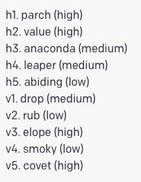
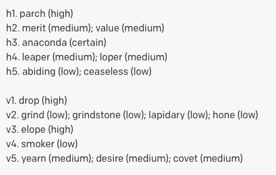

## 개요

"Tree of Thoughts: Deliberate Problem Solving with Large Language Models" (Yao et al., 2024)는 Princeton 대학교의 Shunyu Yao, Karthik Narasimhan과 Google DeepMind의 공동 연구로 NeurIPS 2023에서 발표되었습니다. 이 논문은 기존 [[chain-of-thought]]와 [[self-consistency]]의 한계를 넘어, LLM의 추론 과정을 **트리 구조로 확장**하여 탐색(search)과 평가(evaluation)를 결합하는 **Tree of Thoughts(ToT)** 프레임워크를 제안합니다.

핵심 아이디어는 인간의 **숙고적 사고(deliberate thinking)**에서 영감을 받았습니다. Daniel Kahneman의 이중 과정 이론에서 System 2에 해당하는 느리고 신중한 사고 방식을 LLM에 구현한 것입니다. 기존 CoT가 왼쪽에서 오른쪽으로 단일 방향의 추론 체인을 생성하는 반면, ToT는 여러 분기를 탐색하고, 각 분기의 유망도를 평가하며, 필요시 이전 단계로 되돌아가는(backtracking) 능력을 갖춥니다.

Game of 24(4개의 숫자로 24 만들기) 문제에서 CoT의 성공률 4%를 **74%**로 끌어올리는 등, 탐색과 전략적 전진/후퇴가 필요한 문제에서 압도적인 성능 향상을 보여줍니다.

## 배경 및 동기

### 기존 프롬프팅 방법의 스펙트럼

이 논문은 기존 프롬프팅 방법들을 **탐색 공간의 구조** 관점에서 통합적으로 분석합니다.

**1. IO (Input-Output) 프롬프팅**: 입력에서 출력으로의 직접 매핑. 단일 경로, 중간 과정 없음.

$$\text{Input} \xrightarrow{\text{LLM}} \text{Output}$$

**2. Chain-of-Thought (CoT)**: 중간 추론 단계를 포함하지만, 여전히 **단일 선형 체인**. 한 번 잘못된 방향으로 가면 복구가 불가능합니다.

$$\text{Input} \xrightarrow{} s_1 \xrightarrow{} s_2 \xrightarrow{} \cdots \xrightarrow{} s_n \xrightarrow{} \text{Output}$$

**3. CoT + Self-Consistency (CoT-SC)**: 다수의 독립적인 체인을 샘플링하고 다수결 투표. 다양한 경로를 탐색하지만, 각 체인은 여전히 독립적이며 **중간 단계에서의 평가나 되돌아가기가 불가능**합니다.

**4. Tree of Thoughts (ToT)**: 각 중간 단계에서 여러 후보를 생성하고, 각 후보를 평가한 뒤, 유망한 방향만 선택적으로 탐색. **백트래킹(backtracking)** 가능.

### CoT와 Self-Consistency의 근본적 한계

[[chain-of-thought]]와 [[self-consistency]]는 다음과 같은 유형의 문제에서 근본적으로 한계를 보입니다.

**1. 탐색이 필요한 문제**: Game of 24처럼 가능한 연산의 조합을 체계적으로 탐색해야 하는 문제에서, 왼쪽-오른쪽 단방향 생성은 올바른 조합을 찾을 확률이 매우 낮습니다.

**2. 전략적 전진/후퇴가 필요한 문제**: Crossword 퍼즐처럼 이전 선택이 이후 선택을 제약하며, 막다른 길에 도달하면 되돌아가서 다른 선택을 해야 하는 문제입니다.

**3. 중간 평가가 유용한 문제**: 전체 추론을 완료하기 전에 현재 방향이 유망한지 평가할 수 있는 문제. CoT는 추론이 끝나야만 답을 확인할 수 있지만, ToT는 중간에 평가하여 비효율적인 경로를 조기에 가지치기(pruning) 할 수 있습니다.

### 인지과학적 배경

ToT의 설계는 인지과학의 두 가지 핵심 이론에 기반합니다.

**이중 과정 이론(Dual Process Theory)**: Kahneman(2011)이 제안한 System 1(빠르고 직관적)과 System 2(느리고 숙고적) 사고 모델에서, 기존 LLM은 주로 System 1에 해당합니다. ToT는 LLM에 System 2적 사고를 부여하려는 시도입니다.

**문제 공간 탐색(Problem Space Search)**: Newell & Simon(1972)의 인간 문제 해결 이론에 따르면, 인간은 문제를 초기 상태에서 목표 상태로 이동하는 탐색 과정으로 봅니다. ToT는 이 탐색 과정을 LLM 기반으로 구현합니다.

## 핵심 아이디어

### ToT 프레임워크의 4가지 핵심 구성 요소

ToT는 다음 4가지 질문에 대한 답으로 구성됩니다.

**1. 사고의 분해(Thought Decomposition)**: "중간 사고 단계를 어떻게 정의할 것인가?"

사고(thought)는 언어 시퀀스로 표현되는 중간 추론 단계입니다. 너무 작으면(한 단어) 의미 있는 평가가 어렵고, 너무 크면(전체 풀이) 분기의 이점이 사라집니다. 적절한 크기는 문제 유형에 따라 달라집니다.

- **Game of 24**: 하나의 산술 연산 (예: "4 + 9 = 13")
- **Creative Writing**: 하나의 문단 계획
- **Mini Crosswords**: 하나의 단어 채우기

**2. 사고 후보 생성(Thought Generator)**: "각 단계에서 어떤 후보들을 생성할 것인가?"

두 가지 생성 전략을 제안합니다.

- **샘플링(Sampling)**: CoT 프롬프트로 $k$개의 독립적 사고를 iid 샘플링. 사고 공간이 풍부하고 다양성이 중요할 때 적합합니다.
- **제안(Propose)**: "다음 단계의 가능한 후보들을 나열하시오"와 같은 프롬프트로 LLM에게 여러 후보를 한 번에 제안하도록 요청. 사고 공간이 제한적이고 구조적일 때 적합합니다.

**3. 상태 평가(State Evaluator)**: "현재 상태가 얼마나 유망한가?"

LLM을 휴리스틱 평가 함수로 활용합니다. 두 가지 평가 방식이 있습니다.

- **독립 평가(Value)**: 각 상태를 독립적으로 평가. "이 상태에서 문제를 풀 수 있는 확률은?" → {sure/maybe/impossible}
- **상대 투표(Vote)**: 여러 후보 상태를 비교하여 "어느 것이 가장 유망한가?" 투표

**4. 탐색 알고리즘(Search Algorithm)**: "트리를 어떤 순서로 탐색할 것인가?"

- **BFS(Breadth-First Search)**: 각 레벨에서 상위 $b$개의 유망한 상태만 유지. 탐색 공간이 넓지만 깊지 않은 문제에 적합.
- **DFS(Depth-First Search)**: 깊이 우선으로 탐색하되, 유망하지 않은 상태에서 백트래킹. 탐색 공간이 깊고 조기 가지치기가 가능한 문제에 적합.

### 형식적 정의

ToT를 형식적으로 정의하면 다음과 같습니다.

트리의 각 노드는 부분 해(partial solution) $s = [x, z_1, \ldots, z_t]$로 표현됩니다. 여기서 $x$는 입력, $z_i$는 $i$번째 사고 단계입니다.

사고 생성: $z_t^{(j)} \sim p_\theta(z \mid s_{t-1})$ 또는 $[z_t^{(1)}, \ldots, z_t^{(k)}] \sim \text{Propose}(p_\theta, s_{t-1})$

상태 평가: $V(s) = \text{LLM}(\text{eval\_prompt}, s)$

탐색: BFS는 각 레벨에서 $\text{top-}b$ 상태를 유지하고, DFS는 $V(s) > \text{threshold}$인 상태만 탐색합니다.

## 실험 결과

### Game of 24

Game of 24는 4개의 숫자와 기본 산술 연산(+, -, *, /)을 사용하여 24를 만드는 수학 퍼즐입니다. 이 문제는 조합적 탐색이 필요하며, 기존 LLM 프롬프팅 방법으로는 극히 낮은 성공률을 보이는 대표적인 난제입니다.

| 방법 | 성공률 |
|------|--------|
| IO prompt | 7.3% |
| CoT prompt | 4.0% |
| CoT-SC (k=100) | 9.0% |
| **ToT (b=1)** | **45%** |
| **ToT (b=5)** | **74%** |

ToT는 BFS 탐색(breadth $b=5$)을 사용하여 **74%**의 성공률을 달성합니다. 이는 CoT(4.0%)의 약 **18.5배**에 달하는 향상입니다. CoT-SC가 100개의 샘플을 사용해도 9.0%에 그치는 것과 비교하면, 탐색 구조의 중요성이 명확히 드러납니다.

Game of 24에서 ToT의 각 단계는 하나의 산술 연산입니다. 예를 들어 "4, 9, 10, 13"이 주어지면 첫 단계에서 "13 - 9 = 4 (남은 수: 4, 4, 10)"과 같은 연산을 제안하고, LLM이 남은 수로 24를 만들 수 있는지 평가합니다.

### Creative Writing

Creative Writing 태스크는 4개의 랜덤 문장을 입력으로 받아, 각 문장으로 끝나는 4개의 문단으로 이루어진 일관된 이야기를 작성하는 것입니다.

이 태스크에서는 BFS를 사용합니다. 먼저 5개의 이야기 계획(plan)을 생성하고, 투표로 가장 좋은 계획을 선택한 뒤, 해당 계획에 따라 이야기를 작성합니다.

| 방법 | GPT-4 선호도 (1-10 비교) |
|------|------------------------|
| IO | 3.2 |
| CoT | 4.8 |
| **ToT** | **7.56** |

GPT-4를 평가자로 사용한 비교에서, ToT로 생성된 이야기가 IO나 CoT보다 일관성과 창의성 면에서 크게 선호됩니다.

### Mini Crosswords

5x5 미니 크로스워드 퍼즐은 가장 복잡한 태스크로, DFS + 백트래킹을 사용합니다.

*Figure 1: Mini Crosswords 태스크의 프롬프트 예시. 5x5 크로스워드 퍼즐에서 가로/세로 단서가 주어지면, LLM이 각 빈칸에 들어갈 후보 단어와 확신도(certain/high/medium/low)를 제안한다. (Yao et al., 2024)*

*Figure 2: LLM이 생성한 첫 번째 후보 단어 목록. 각 단어에 대해 확신도(high, medium, low, certain)를 함께 출력하여 탐색 우선순위를 결정하는 데 활용한다. (Yao et al., 2024)*

*Figure 3: 탐색 과정에서 더 많은 후보가 발견되는 예시. 한 단어를 채운 후 남은 단서에 대해 다시 후보를 생성하면, 기존에는 확신도가 낮았던 단어에 대해 새로운 후보가 발견될 수 있다. 백트래킹을 통해 교차 제약을 만족하는 최적의 조합을 탐색한다. (Yao et al., 2024)*

| 방법 | 단어 성공률 | 게임 성공률 |
|------|------------|------------|
| IO | 38.7% | 0% |
| CoT | 40.6% | 0% |
| ToT (DFS) | **78%** | **60%** |

크로스워드는 가로 단어와 세로 단어가 겹치는 글자를 공유하므로, 하나의 단어를 채우는 것이 다른 단어의 선택을 제약합니다. DFS + 백트래킹은 이러한 제약 만족 문제(CSP)에 특히 효과적입니다.

## 방법론 상세 분석

### BFS vs DFS 선택 기준

| 특성 | BFS | DFS |
|------|-----|-----|
| 최적 | 가장 유망한 $b$개 유지 | 깊이 우선 탐색 |
| 백트래킹 | 불필요 | 핵심 요소 |
| 메모리 | $O(b \cdot d)$ | $O(d)$ |
| 적합한 문제 | 고정 깊이, 넓은 탐색 | 가변 깊이, 제약 만족 |
| 예시 | Game of 24, Creative Writing | Mini Crosswords |

### 자기 평가의 효과와 한계

ToT의 핵심 요소 중 하나인 LLM 기반 상태 평가는 강력하지만 한계도 있습니다.

**장점**: 도메인 특화 휴리스틱을 설계할 필요 없이, LLM의 일반적 추론 능력으로 다양한 문제에 적용 가능합니다. 또한 자연어로 평가 이유를 설명할 수 있어 해석 가능합니다.

**한계**: LLM의 평가가 항상 정확하지는 않습니다. 특히 수학적으로 엄밀한 판단이 필요한 경우(예: 남은 수로 24를 만들 수 있는지) 오판할 수 있습니다. 논문에서도 Game of 24에서 LLM 평가기의 정확도가 약 60~70% 수준임을 보고합니다.

:::warning
ToT의 LLM API 호출 횟수는 탐색의 너비(breadth)와 깊이(depth)에 비례하여 증가합니다. Game of 24의 경우 한 문제당 수십 회의 API 호출이 필요할 수 있으므로, 비용과 지연 시간을 고려한 설계가 필요합니다.
:::

### IO/CoT/CoT-SC/ToT의 통합적 비교

ToT는 기존 방법들을 특수한 경우로 포함하는 일반적 프레임워크입니다.

- **IO**: 깊이 1, 너비 1의 ToT
- **CoT**: 깊이 $n$, 너비 1의 ToT (탐색 없음)
- **CoT-SC**: 깊이 $n$, 너비 $k$의 ToT (중간 평가 없음, 최종 단계에서만 투표)
- **ToT**: 깊이 $n$, 너비 $b$의 ToT (중간 평가 + 탐색 알고리즘)

## 한계 및 의의

### 한계

1. **높은 추론 비용**: 각 단계에서 후보 생성과 평가 모두 LLM 호출이 필요하므로, 총 API 호출 수가 크게 증가합니다. Game of 24의 경우 단일 CoT 대비 약 20~50배의 호출이 필요합니다.

2. **문제별 설계 필요**: 사고의 분해 방식, 평가 방식, 탐색 알고리즘을 문제 유형에 맞게 설계해야 합니다. 이는 CoT의 범용성에 비해 적용의 편의성이 떨어집니다.

3. **제한된 평가 범위**: 논문에서 평가한 3가지 태스크(Game of 24, Creative Writing, Mini Crosswords)가 다소 제한적이며, 실세계 응용에서의 효과는 추가 검증이 필요합니다.

4. **LLM 평가기의 불완전성**: 상태 평가에 LLM을 사용하므로, 평가 자체가 부정확할 수 있으며, 이 오류가 탐색 과정에서 증폭될 가능성이 있습니다.

### 학술적 의의

1. **추론 패러다임의 확장**: CoT의 선형 추론을 트리 구조로 확장하여, LLM이 탐색과 평가를 결합한 숙고적 문제 해결을 수행할 수 있음을 보여주었습니다.

2. **고전적 AI와 LLM의 결합**: BFS, DFS 등 고전적 탐색 알고리즘을 LLM의 자연어 추론 능력과 결합하는 패러다임을 제시했습니다. 이는 이후 LLM + MCTS(Monte Carlo Tree Search), [[reflexion]] 등 다양한 하이브리드 접근법의 기초가 됩니다.

3. **일반적 문제 해결 프레임워크**: ToT는 특정 문제에 특화된 솔루션이 아니라, 사고 분해/생성/평가/탐색의 4요소로 구성된 일반적 프레임워크를 제공합니다.

### 후속 연구

- **Graph of Thoughts (GoT)**: 트리를 그래프로 확장하여 사고 간의 비순환적 결합도 허용
- **Algorithm of Thoughts (AoT)**: LLM이 탐색 알고리즘 자체를 내재화
- **RAP (Reasoning via Planning)**: MCTS를 활용한 더 정교한 탐색
- **LLM + MCTS**: AlphaGo 스타일의 MCTS를 LLM 추론에 적용
- **OpenAI o1/o3**: 내재적 탐색과 평가를 학습시킨 추론 모델

## 추가 분석

### 비용 분석

ToT의 비용을 상세히 분석하면 다음과 같습니다.

**Game of 24 (BFS, b=5, 3 steps)**:

각 단계에서의 LLM 호출 수를 계산하면 다음과 같습니다.

1. 사고 생성: 각 상태에서 $k$개의 후보 생성. 1단계: $k$개, 2단계: $b \times k$개, 3단계: $b \times k$개
2. 상태 평가: 각 후보에 대해 1회 평가 호출. 총 $k + b \times k + b \times k$회
3. 최종: 약 100~200회의 LLM 호출 (단일 CoT 대비 약 100배)

이 비용은 상당하지만, Game of 24에서 CoT의 4% 성공률을 74%로 끌어올리는 것의 가치를 고려하면, **불가능한 문제를 가능하게 만드는** 비용으로 볼 수 있습니다.

**Mini Crosswords (DFS, 백트래킹)**:

DFS의 경우 최악의 경우 트리 전체를 탐색하지만, 가지치기와 백트래킹으로 실제 탐색 노드 수는 크게 줄어듭니다. 평균적으로 약 50~150회의 LLM 호출이 필요합니다.

:::tip
실무에서 ToT를 적용할 때는, 문제의 특성에 따라 비용 대비 효과를 신중히 평가해야 합니다. 모든 문제에 ToT가 필요한 것은 아니며, 단순 CoT나 Self-Consistency로 충분한 문제에는 더 가벼운 방법을 사용하는 것이 효율적입니다.
:::

### 사고 크기(Thought Granularity)의 영향

ToT에서 "사고(thought)"의 크기를 어떻게 설정하는가는 성능에 중요한 영향을 미칩니다.

**너무 세밀한 사고** (예: 단일 토큰 수준):
- 평가가 의미를 갖기 어려움: "4"라는 숫자 하나로는 유망도를 판단할 수 없음
- 트리의 깊이가 너무 깊어져 탐색 비용이 폭증

**너무 큰 사고** (예: 전체 풀이):
- CoT와 사실상 동일해져 탐색의 이점이 사라짐
- 중간 평가와 백트래킹의 기회가 없어짐

**적절한 사고** (예: 하나의 의미 있는 추론 단계):
- Game of 24: 하나의 산술 연산 → 3단계 깊이
- Creative Writing: 문단 계획 → 2단계 (계획 + 실행)
- Mini Crosswords: 하나의 단어 → 5~10단계 (단어 수)

논문에서는 이 적절한 크기를 태스크에 따라 수동으로 설계하며, 자동으로 최적의 사고 크기를 결정하는 방법은 향후 연구 과제로 남아 있습니다.

### CoT-SC와의 근본적 차이

[[self-consistency]]와 ToT는 모두 다수의 추론 경로를 탐색한다는 점에서 유사해 보이지만, 근본적인 차이가 있습니다.

| 속성 | CoT-SC | ToT |
|------|--------|-----|
| 경로 간 독립성 | 완전 독립 | 상호 영향 (탐색) |
| 중간 평가 | 없음 (최종 답만 비교) | 매 단계 평가 |
| 백트래킹 | 불가능 | 가능 (DFS) |
| 정보 흐름 | 단방향 (왼→오) | 양방향 (탐색+백트래킹) |
| 효과적인 문제 유형 | 다양한 풀이법이 있는 문제 | 탐색/제약이 필요한 문제 |

CoT-SC는 "여러 번 시도해서 가장 많은 동의를 얻는 답을 선택"하는 반면, ToT는 "체계적으로 가능성을 탐색하면서 유망한 방향을 깊이 파고드는" 접근입니다.

### 실무 적용 가이드라인

ToT를 실무에 적용할 때의 가이드라인을 정리하면 다음과 같습니다.

**1. ToT가 적합한 문제 유형**:
- 명확한 정답이 있고, 중간 상태에서 유망도를 평가할 수 있는 문제
- 백트래킹이 필요한 제약 만족 문제
- 기존 CoT로 성능이 낮고, 추론 경로의 체계적 탐색이 도움이 될 수 있는 문제

**2. ToT가 부적합한 문제 유형**:
- 단순한 질의응답 (CoT로 충분)
- 자유 형식 텍스트 생성 (평가 기준이 모호)
- 실시간 응답이 필요한 경우 (높은 지연 시간)

**3. 구현 시 고려사항**:
- BFS/DFS 선택은 문제의 깊이와 너비에 따라 결정
- 평가 프롬프트의 설계가 전체 성능에 결정적 영향
- 병렬 API 호출로 BFS의 지연 시간을 줄일 수 있음
- 비용 상한(최대 API 호출 수)을 설정하여 비용 폭발 방지

### 현대 추론 모델과의 관계

ToT가 제시한 "탐색 + 평가" 원리는 현대 추론 최적화 모델에 깊이 반영되어 있습니다.

**OpenAI o1/o3**: 내부적으로 추론 과정에서 다수의 경로를 탐색하고, 보상 모델(reward model)로 각 경로를 평가하며, 유망한 경로를 선택하는 메커니즘을 학습합니다. 이는 ToT의 BFS + 자기 평가를 모델 내부에 통합한 것으로 볼 수 있습니다.

**DeepSeek-R1**: 강화학습을 통해 다양한 추론 전략을 학습하며, 추론 과정에서 자연스럽게 탐색과 백트래킹을 수행합니다.

이러한 모델들은 ToT의 **외부적 탐색 프레임워크**를 **내재적 능력**으로 변환한 것으로, ToT가 제시한 원리의 진화된 형태입니다.

## 결론

Tree of Thoughts는 LLM의 추론을 "토큰 생성"에서 "문제 공간 탐색"으로 패러다임을 전환한 논문입니다. CoT가 LLM에게 "단계적으로 생각하라"고 가르쳤다면, ToT는 "여러 가능성을 탐색하고, 평가하고, 필요하면 되돌아가라"고 가르칩니다.

이 논문의 가장 큰 통찰은, LLM의 추론 능력이 모델 자체뿐 아니라 **추론 과정의 구조(topology)**에 의해서도 크게 좌우된다는 것입니다. 같은 모델이라도 선형 체인(CoT)보다 트리 구조(ToT)로 추론하면 훨씬 어려운 문제를 풀 수 있습니다.

또한, ToT는 고전적 AI의 탐색 알고리즘(BFS, DFS, 휴리스틱 평가)과 현대 LLM의 자연어 추론 능력을 결합한 **하이브리드 접근법**의 대표적 사례입니다. 규칙 기반의 기호적 AI와 신경망 기반의 연결주의 AI를 통합하려는 오랜 AI 연구의 꿈을 부분적으로 실현한 것으로 평가됩니다.

이 원리는 이후 OpenAI의 o1, o3, DeepSeek-R1 등 추론 최적화 모델의 설계에도 핵심적인 영향을 미쳤으며, "사고의 구조"가 AI 추론 연구의 핵심 연구 주제로 자리잡는 계기를 마련했습니다.
